+++
date = '2025-09-12T13:51:11+09:00'
draft = false
title = '幽霊プラチナちゃんの資料'
slug = 'About_of_Platnium_Ghost'
tags = ["Avaters"]
categories = ["Avaters"]
comments = false
+++
## トップビジュアル
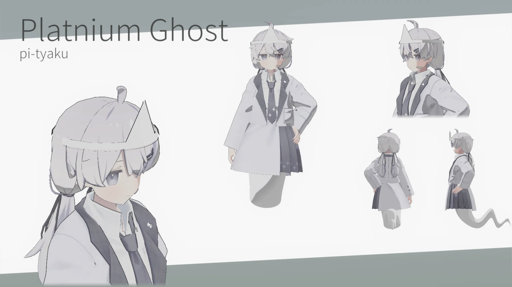

## 基本情報
- アバター名
Platnium Ghost
- モデル出典／作者リンク
  - 素体:https://mk22.booth.pm/items/3950859
  - 足(?):https://shagunacazanera.booth.pm/items/4979968
- 対応（PC／Quest・パフォーマンスランク）
PC:Poor~VeryPoor
Quest(一部アバターのみ):VeryPoor
- 権利関係の注記
このアバターは「ぷらすわん」様制作のモデルを購入・利用し、衣装やテクスチャなどを改変したものです。  
元モデルの著作権は制作者に帰属します。  
改変部分は私個人の利用のために作成しており、再配布は行いません。
本ページに掲載しているスクリーンショット・画像の無断転載はご遠慮ください。  
Skebなど依頼時の資料としての閲覧・参照は問題ありません。

## 全身資料
### 3面図
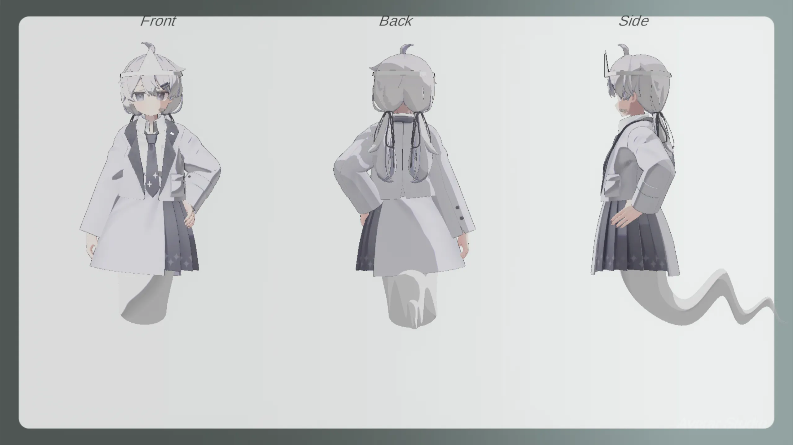

## 表情集
### メイン表情
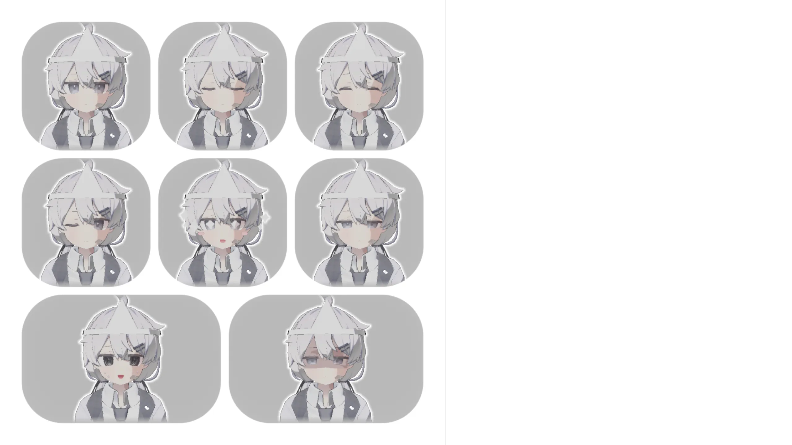

### サブ表情
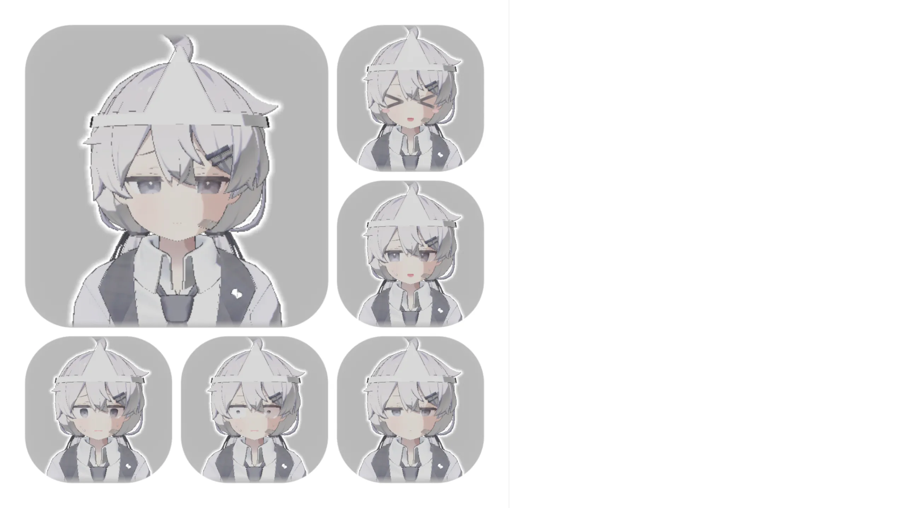

## 衣装
- Default
- [浴衣](https://8-dori.booth.pm/items/4872298) 
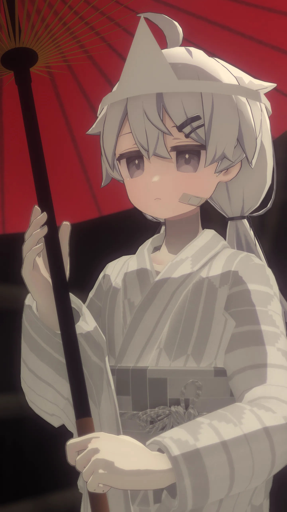

- [スーツ](https://rihyaco.booth.pm/items/5018741) 
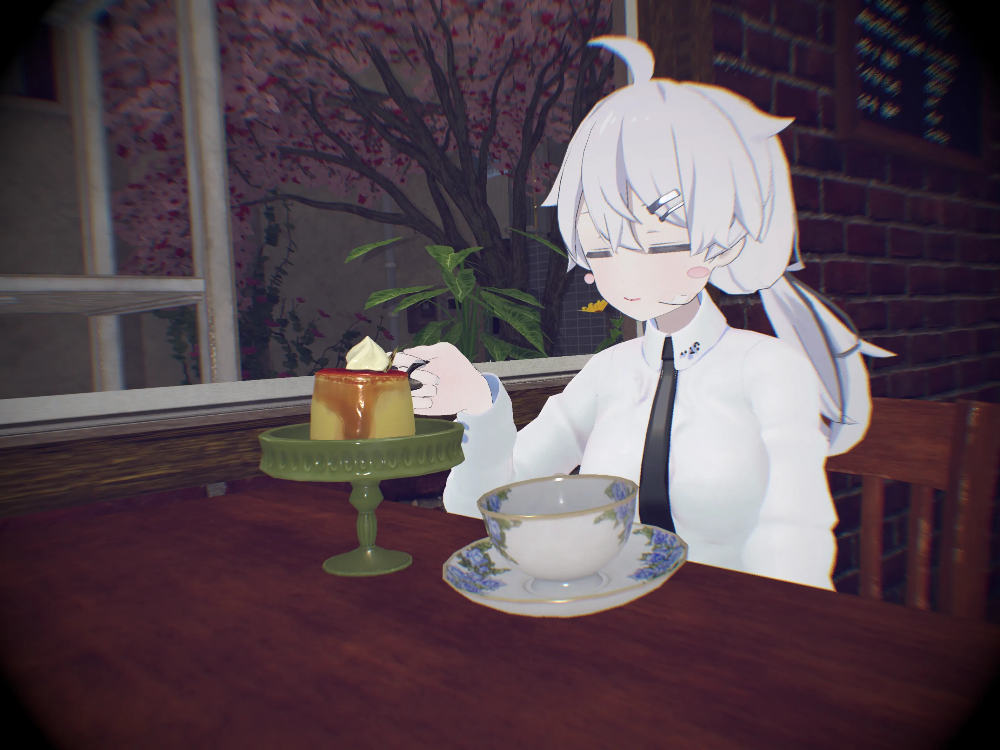

- [Hail_Cloth](https://poy.booth.pm/items/5207755) 
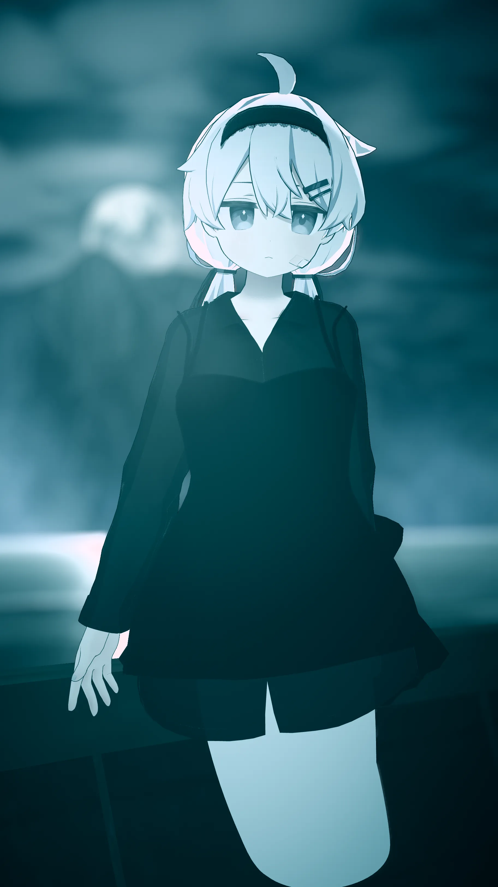

- [大学生コーデ](https://asarichan.booth.pm/items/4133041) 
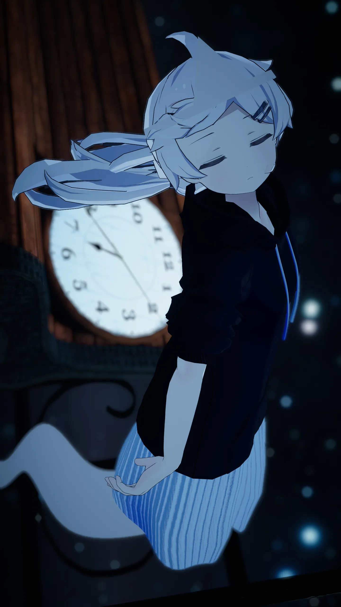

- [ワンピース](https://booth.pm/ja/items/4060991) 
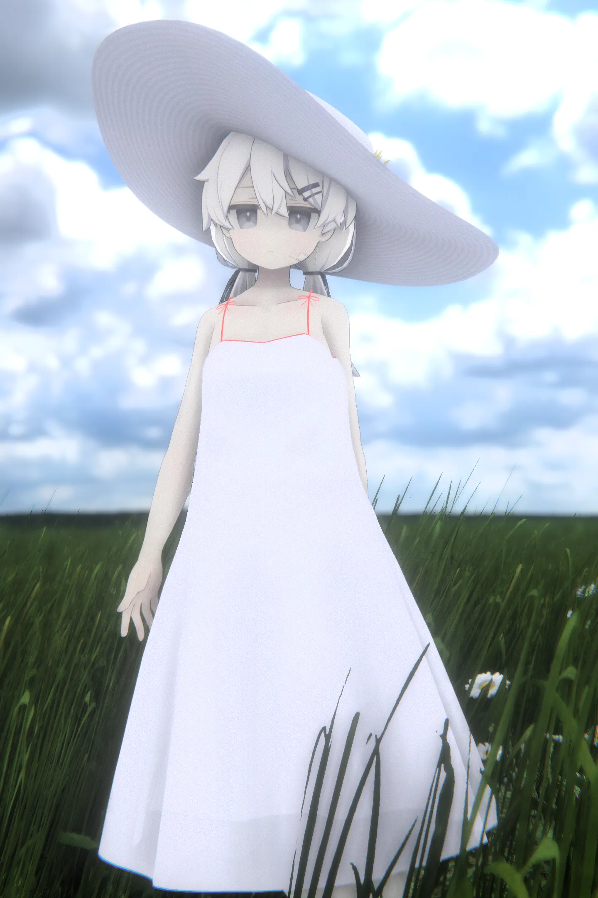

- 透過ver 
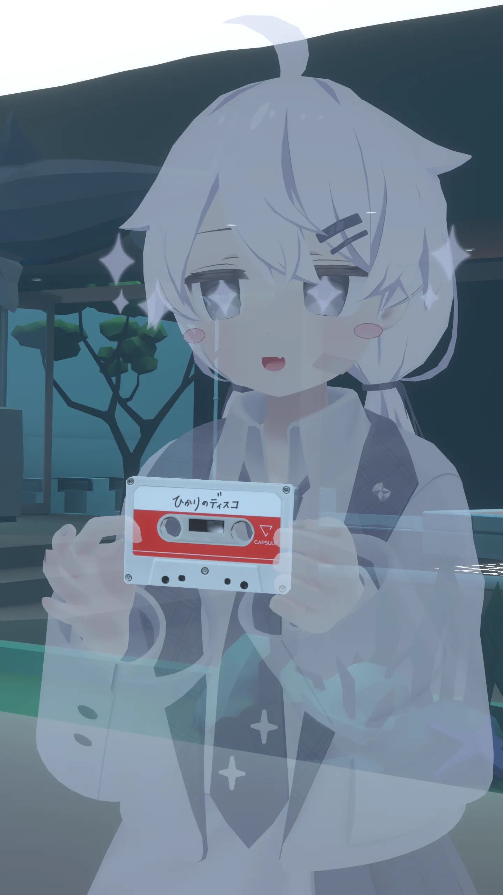
## アクセサリー
- 鬼火 
https://amakusa-shop.booth.pm/items/5010477
- 天冠(頭の三角巾みたいなやつ) 
https://shagunacazanera.booth.pm/items/4979968
- 目隠し 
https://booth.pm/ja/items/5997446
- ポラロイドカメラ 
https://photoboio.gumroad.com/l/rgiyyl?layout=profile&recommended_by=library

## ツール・シェーダー
- ポーズ固定 
https://zerofactory.booth.pm/items/5989814
- 影 
https://booth.pm/ja/items/5135844
- 透過表現用シェーダ 
https://github.com/whiteflare/Unlit_WF_ShaderSuite
- アバターの明るさ調整 
https://booth.pm/ja/items/4864776
## 改変・独自要素
- 下半身を消して幽霊の足を着けています。
- 天冠、鬼火、目隠しを出来るようにしています。
- ジャンク品のポラロイドカメラを装備しています。
- Miso Shadowを利用して影を付けています。
- 撮影用のツールを導入しています。
- 透過の強さを5%,25%,50%,75%で選択できます。(透明版のみ)
  

## 小ネタ
- 3点専用アバターです。フルトラ適正は全く無いです。 
3点でプレイしている際に足が邪魔なのでちょうど良い足?を実装しました。 
- ラジオで紹介されたことが有ります 
[ココ](https://note.com/yuteru_write_sth/n/n36adc9b4cd4d)に話した事が乗ってます。 
- カメラギミックで視界ジャック出来ます。 
仕様です。意図的ではないです。たまに初心者案内に付いていくと視界ジャックの例として使わされるパターンが有ります。 
初心者案内者曰く「比較的安全な視界ジャックだから」と。 

## Q&A
- Q.何で揺れ物が掴めないんですか?
  - A.幽霊なので揺れ物系は掴めないようになっています。
  - 掴めるとこうなります。 
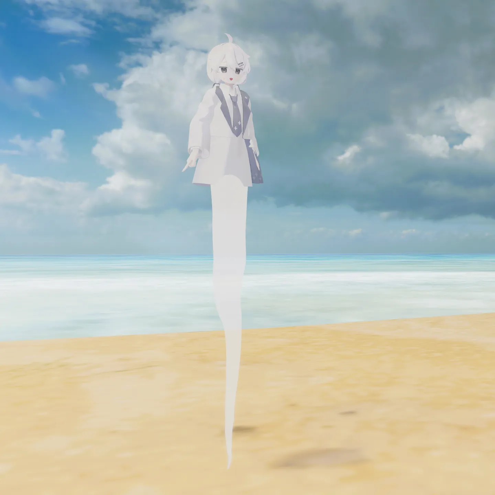

- Q.水着とかの際どい改変は無いんですか?
  - A.ありません。
  - アバターをぶった切っている都合上、服を着ないと繋ぎ目の処理が面倒だからです。
  - Blenderを使えば良いのですが、工数に対するメリットが少ないです。
  - 今後も、実装する気はありません。
- Q.和服を死装束のように着ないのですか?
  - A.着れません。
  - 販売されている和服で死装束になっていたら問題じゃないですか。
  - 基本的に服はそのまま実装しているのでそういう改変はしていません。
  - 簡単にできる or 専用服が出るならやるかも...
- Q.首は取れないんですか?
  - A.取れません。
  - この子を元ネタにしてくれた人の改変と被ります。
  - 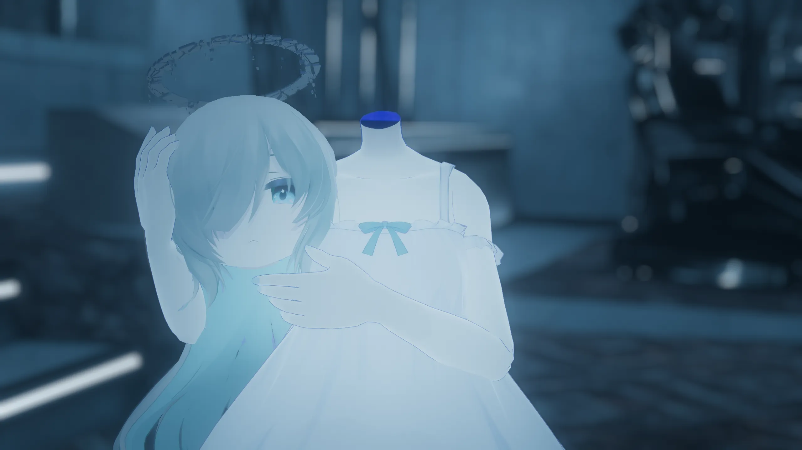 [Underさん](https://x.com/under_vrchat) 

## ギャラリー
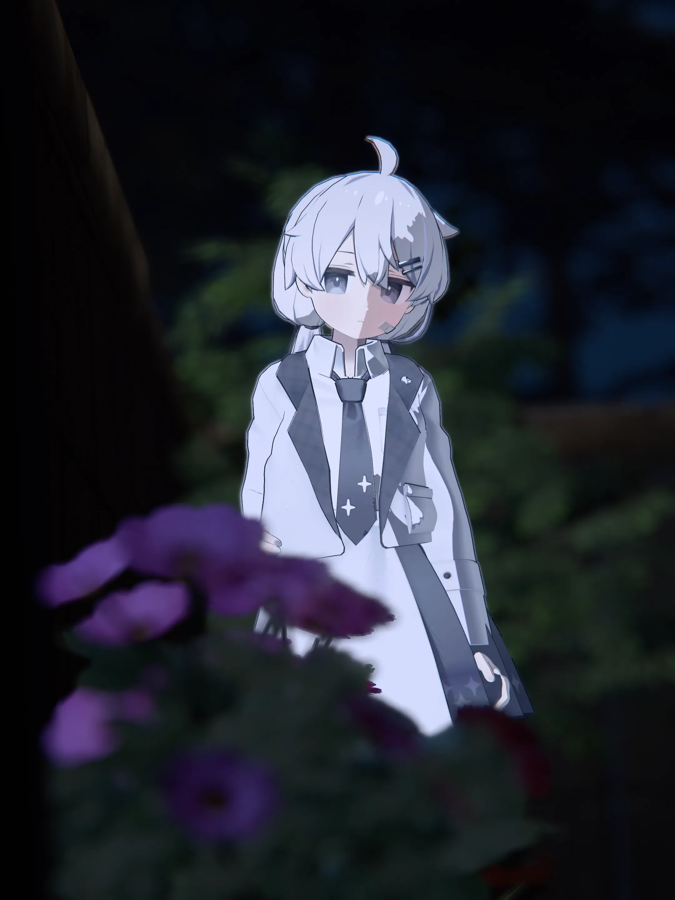
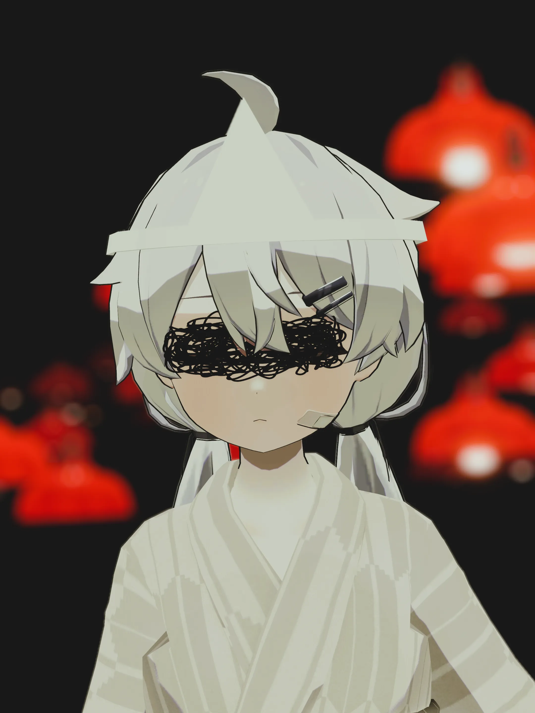 
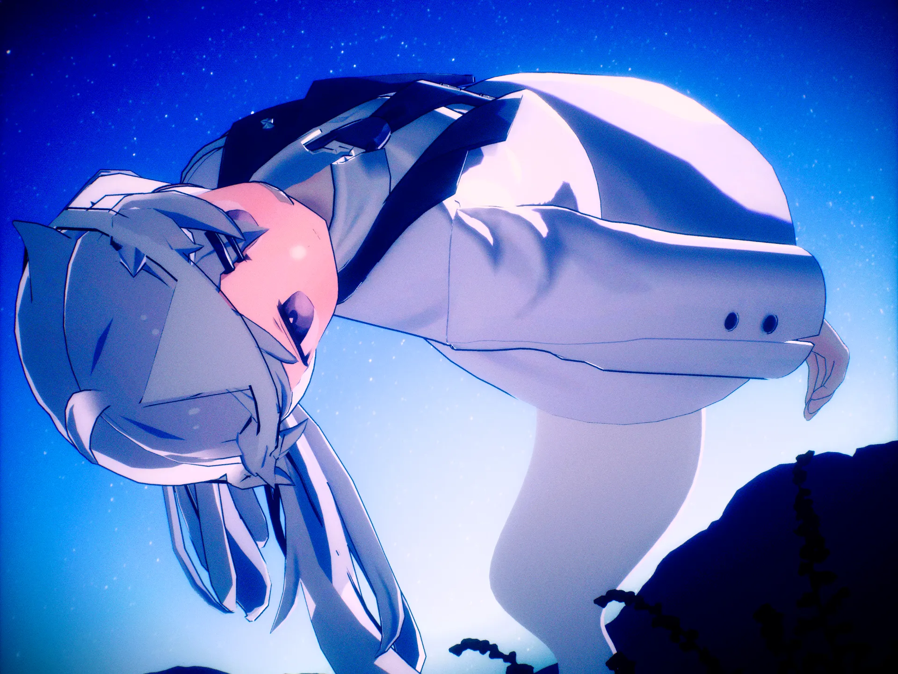
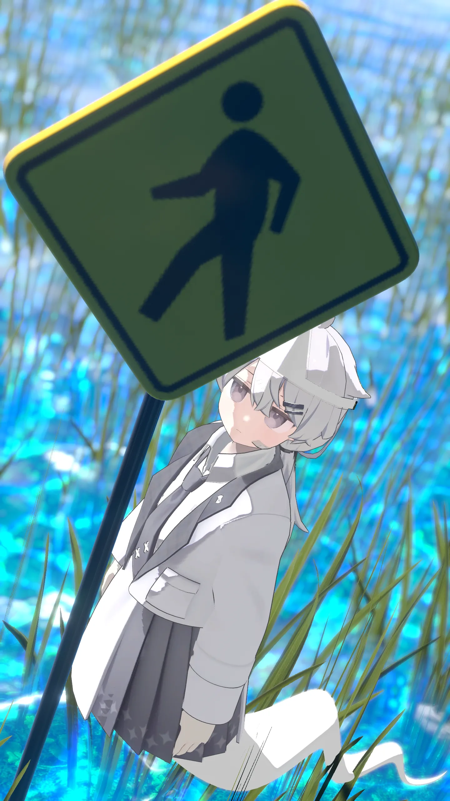 

## 更新日
2025/09/12   アウトライン製作 
2025/09/13   写真追加 
2025/09/23   Q&A追加 
