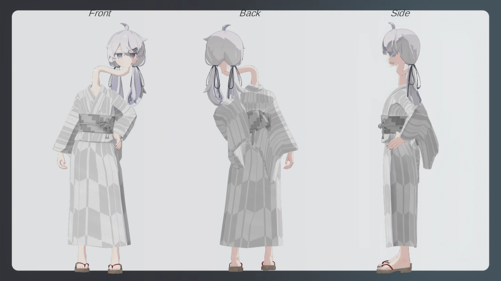
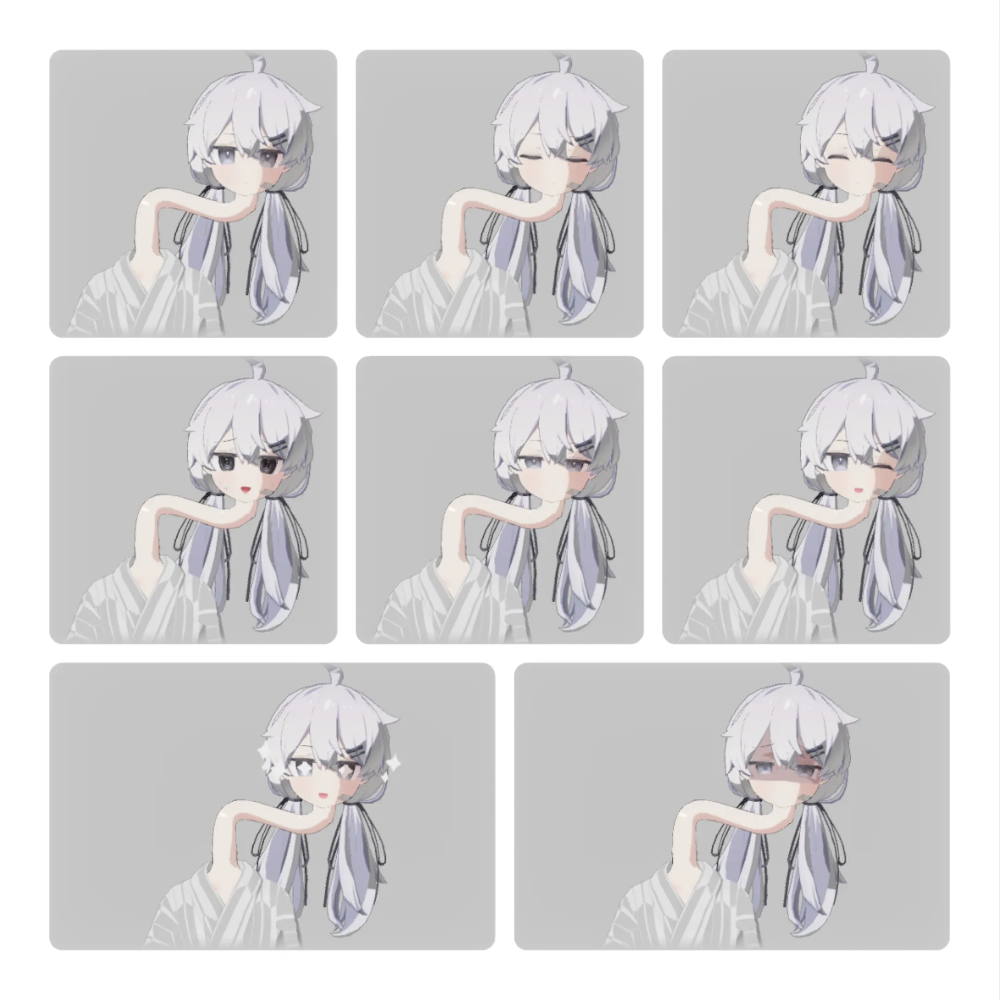
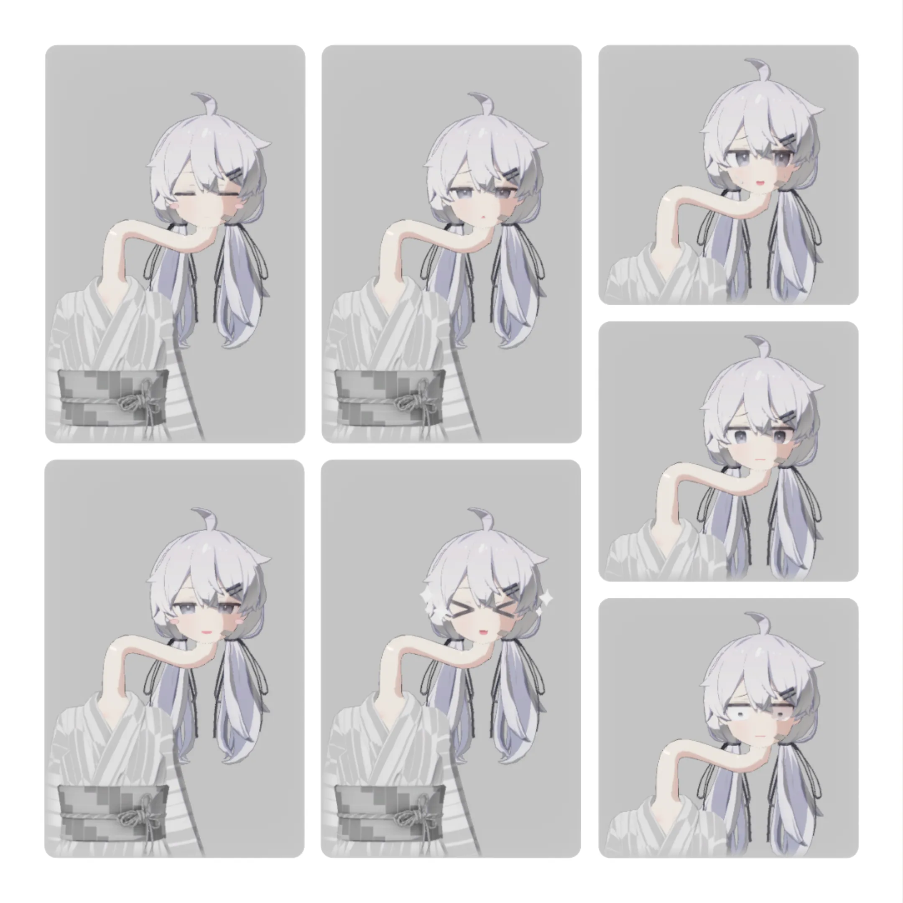

+++
date = '2026-01-17T14:02:59+09:00'
draft = false
title = 'ろくろ首のプラチナちゃんの資料'
slug = 'Platnium_Rokuro Kubi'
tags = ["Avaters"]
categories = ["Avaters"]
comments = false
image = "Header.webp"
+++
## トップビジュアル

## 基本情報
### アバター名
Platnium_rokuro-kubi
### モデル出典／作者リンク
  - 素体:[プラチナ](https://mk22.booth.pm/items/3950859)
  - 首  :自作
  - 服  :[浴衣](https://8-dori.booth.pm/items/4872298)
### 対応（PC／Quest・パフォーマンスランク）
  - PC  :Very Poor
  - Quest,iOSには非対応
### 権利関係の注記
このアバターは「ぷらすわん」様制作のモデルを購入・利用し、衣装やテクスチャなどを改変したものです。  
元モデルの著作権は制作者に帰属します。  
改変部分は私個人の利用のために作成しており、再配布は行いません。
本ページに掲載しているスクリーンショット・画像の無断転載はご遠慮ください。  
Skebなど依頼時の資料としての閲覧・参照は問題ありません。

## 3面図

## 表情集
  

## 改変・独自要素
- 首が伸びています。ろくろ首なので。
  - 伸ばした首や素体、顔等は私個人がBlenderを利用して調整及び制作しました。
  - この際、Blenderを[Momonger氏](https://x.com/Black_Momonger)にご教授及び協力して頂きました。本当にありがとうございました。
- 首はPhysBoneを利用しており、ある程度自由に動きます。
  - PhysBoneを利用しているので一応他人も触れます。
  - 首や頭を移動させて固定とかも出来ます。便利ですね。
- ろくろ首なので和服を着ています。
  - 和服(浴衣)は[こちら](/page/content/avaters/platnium_Ghost/index.md)を流用しました。

## Q&A
- Q.何故また人外改変を?
  - A.人外が続いていたからです。
  - 2度ある事は3度あるので。
  - 今更人間形態で遊んでも競合が多いのでね。
- Q.何故ろくろ首をチョイスしたのか?
  - A.先駆者が居たのと、妖怪をモチーフにするのが面白そうだったから。
  - [幽霊](/page/content/avaters/platnium_Ghost/index.md)(汎用的な人外)->[デュラハン](/page/content/avaters/platnium_dullahan/index.md)(海外の妖精)という風になっています。
  - インパクトが有って、かつ立ち位置が被りづらいろくろ首をチョイスしたって訳です。
  - 幽霊->抜け首≒デュラハン->ろくろ首なので見ようによっては妖怪ばっかりになっています。
- Q.参考にした改変は?
  - A.[itomaki](https://x.com/whitephileo)さんのろくろ首改変です。  

  - この改変が非常に良くて良くて...というわけで作ってみたという所存です。
- Q.ギミックとかを教えて!
  - A.明確に使用したギミック等はありません。
  - 強いて言えばConstraintとかを使っていますがギミックというほどではないです。
- Q.本当に首の部分のアセットは無いの?
  - A.本当に無いです。
  - 有ればどんなに良かったことか...

## ギャラリー

## 更新日
2026/01/27:初版作成