+++
date = '2025-09-24T16:32:10+09:00'
draft = false
title = 'デュラハンのプラチナちゃんの資料'
slug = 'Platnium_dullahan'
tags = []
categories = []
comments = false
+++
## トップビジュアル
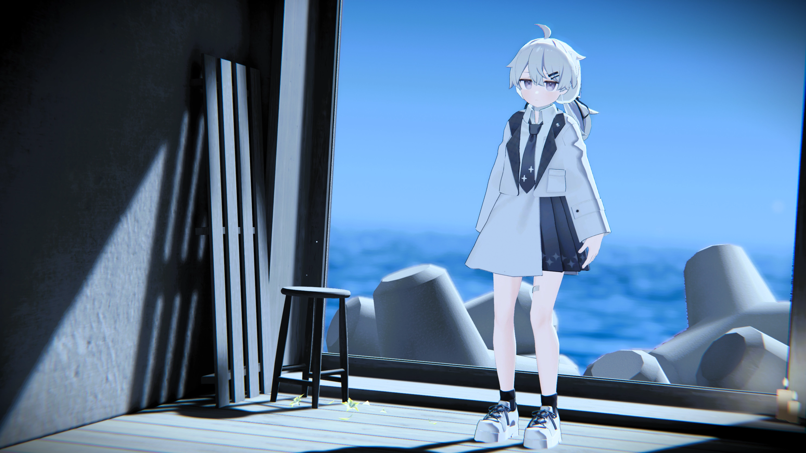
## 基本情報
- アバター名
Platnium_Dulahan
- モデル出典／作者リンク: https://mk22.booth.pm/items/3950859
- ギミック原案及び元ネタ:[あんだVRC](https://x.com/under_vrchat)さん
- 対応:PCのみ
- 権利関係の注記
このアバターは「ぷらすわん」様制作のモデルを購入・利用し、衣装やテクスチャなどを改変したものです。   
元モデルの著作権は制作者に帰属します。 
改変部分は私個人の利用のために作成しており、再配布は行いません。 
本ページに掲載しているスクリーンショット・画像の無断転載はご遠慮ください。   
Skebなど依頼時の資料としての閲覧・参照は問題ありません。 
また、一部ギミックの実装には あんだVRCさん のご協力をいただきました。 
心より感謝いたします。
## 全身・回り込み資料
### 全身資料
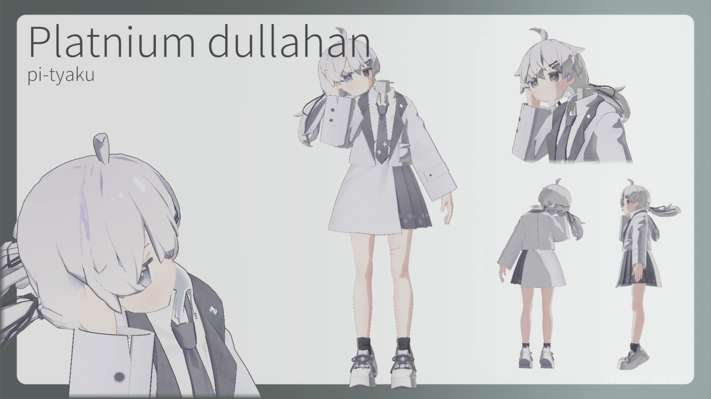

### 3面図
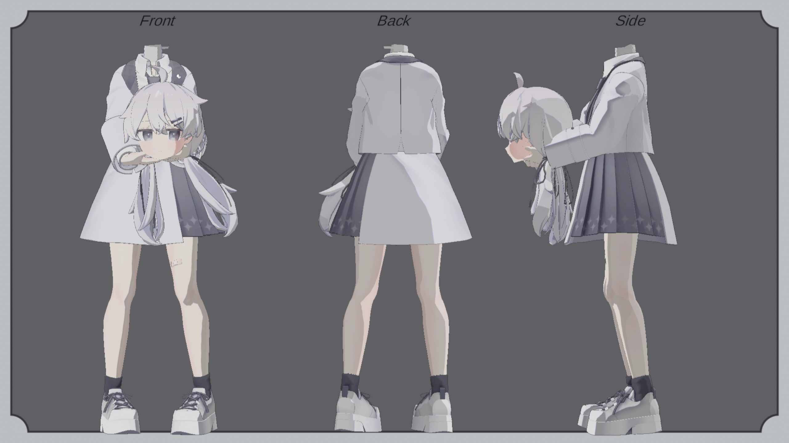

### 表情集
#### 右手

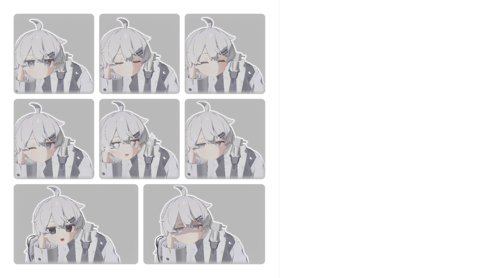

#### 左手
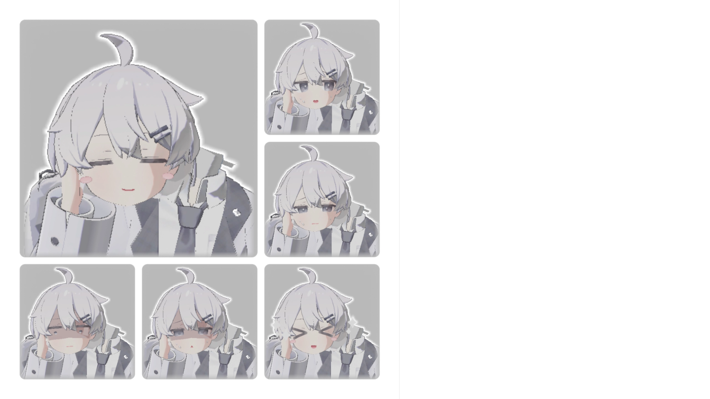

## ツール
- 帽子ギミック
https://booth.pm/ja/items/4977797
- 影
https://booth.pm/ja/items/5135844
- 明るさ調整
https://booth.pm/ja/items/4864776
- ユーティリティツール(座り姿勢、足固定など)
https://franada.booth.pm/items/3290806

## 改変・独自要素
- 頭が取れます。
  - こんな感じに 
 
  - 頭を右手で取り、ワールド固定が出来ます。
  - 更に、ワールド固定した頭は他人が持つことも出来ます。

- 頭を取った際に頭から声が出ます。
  - 「体が目の前に居るのに声が頭から聞こえる」状況が出来ます。

- 一部衣装ではゾンビorキョンシーみたいになります。
  - 基本的には機能は変わりません。見栄えが変わります。
## 衣装
"*"が付いている服は特殊機能付きです。
1. デフォルト
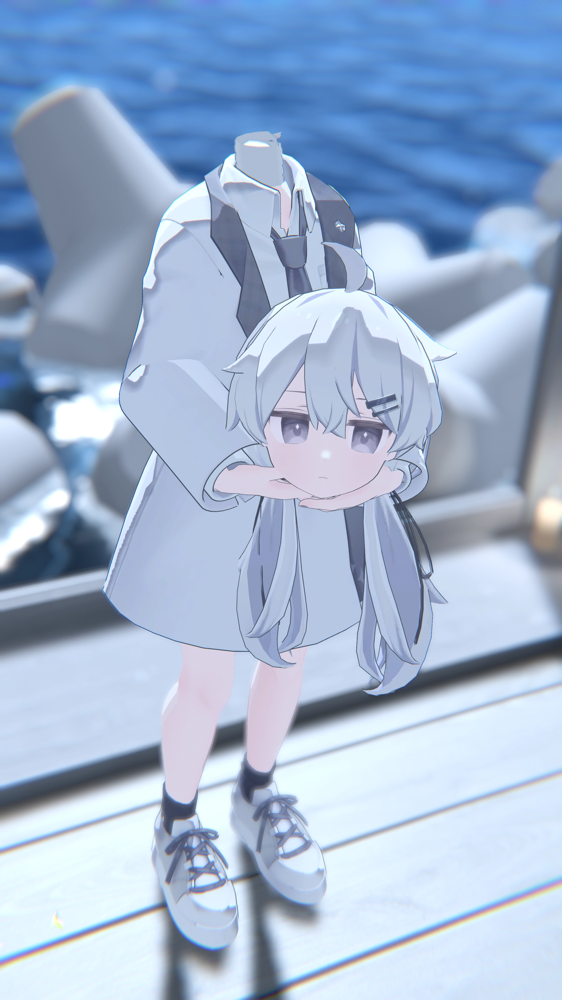

2. Lustorus
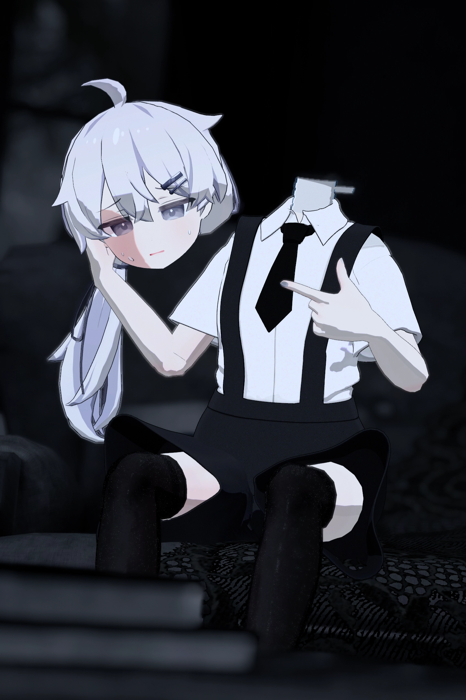

3. ESCAPE PLAN *
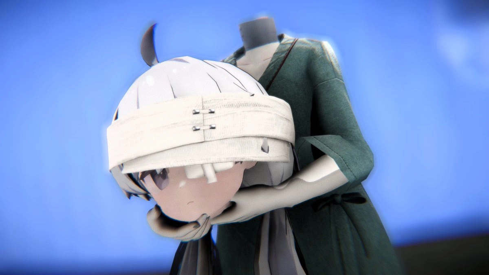   
  
4. Jito Kyon   *
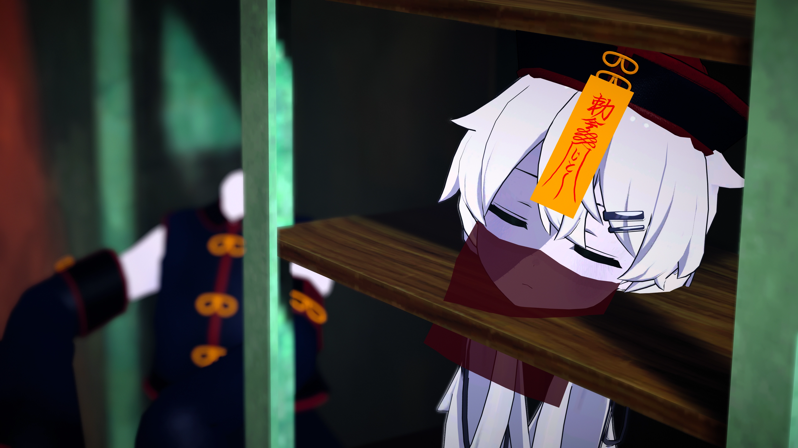

## 小ネタ
- 本気で頭を持って何処かに行かれると面倒です。
  - 自分は声を出しているのに相手には聞こえないという割と絶望的な状況になります。
  - 要するに体だけだと強制無言勢になるからです。
- 視点は首が有った位置のままです。
  - 視点が完全に頭の位置に有ると酔います。
  - 中の人はデュラハンじゃないので人間的にUXを上げる方向性で改変しています。
- 割と評価が2分されやすい気がする子です。
  - びっくりする人、怖がる人、性癖に刺さる人、"可愛い"と言う人、色々反応が有ります。
- 何故かVRCをやっていないX民に刺さっています。
  - デュラハンキャラって少ないですもんね...
- [どこぞのデュラハンアバター](https://avatar.booth.pm/items/6156185)と同様のギミックを搭載しています。
  - 何故かそのアバターの作者及びプロデューサーに知られています。何故?
  - その子も可愛いので是非!
  - 実は持っているのでそのうち記事を公開する予定です。
## Q&A
- Q.アバターギミックは誰が作ったんですか?
  - A.導入部分とオブジェクトはあんだVRCさんが作り、リファクタリング及び声を出す部分は私が作りました。
  - 地味に共同作品です。
- Q.作り方を教えて!
  - A.そのうち作り方を上げます。
  - Blender,Constraint,VRCの仕様に詳しければ**簡単に?**作れると思います。
- Q.何で写真にセンシティブフラグを付けているの?
  - A.一回バズった際にアカウントロックを食らったからです。
  - その際に「自殺を想起させる」と言われましたが、ぶっちゃけ[こっち](/content/avaters/platnium_Ghost/index.md)の方が想起させる気がしています。
  - ~~幽霊なんで自殺を完遂しているようなもんですし。~~
  - なので自衛としてセンシティブフラグを付けています。基本的にR15Overな表現はしないので頭が取れている事が嫌でなければ外して見ても問題ありません。
  - ~~ごく偶に付けるのを忘れることもあります。~~
- Q.エッチなコンテンツは無いの?
  - A.作者の知っている範囲では**存在します**。
  - 探せるところにはありませんが。
- Q.3次創作していい?
  - A.ご自由にどうぞ!歓迎しています!
  - このページを参考にしても構いません。
- Q.何で作ったの?
  - A.頭が取れる子が好きだからです。
  - 大体のことはこの[ラジオ](https://note.com/yuteru_write_sth/n/n36adc9b4cd4d)で話しています。

## ギャラリー

  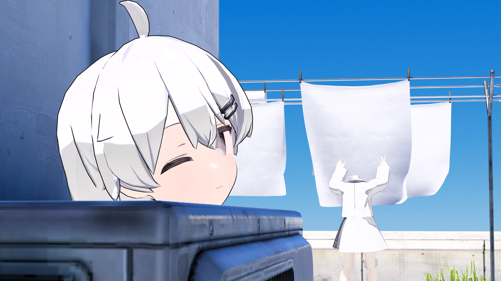 
  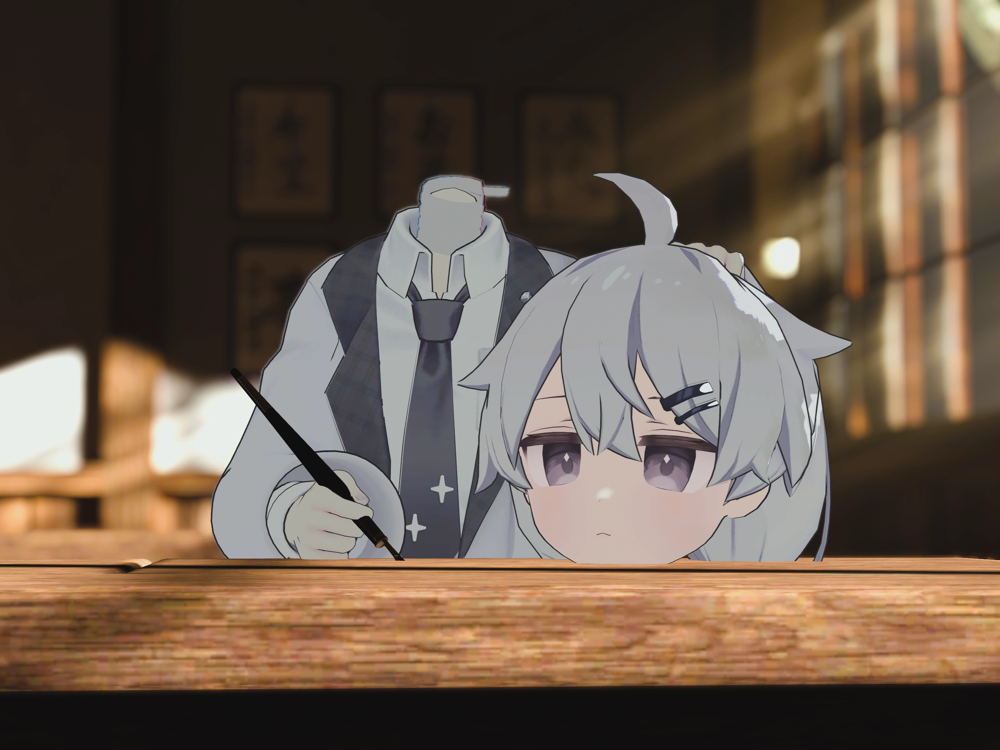 
  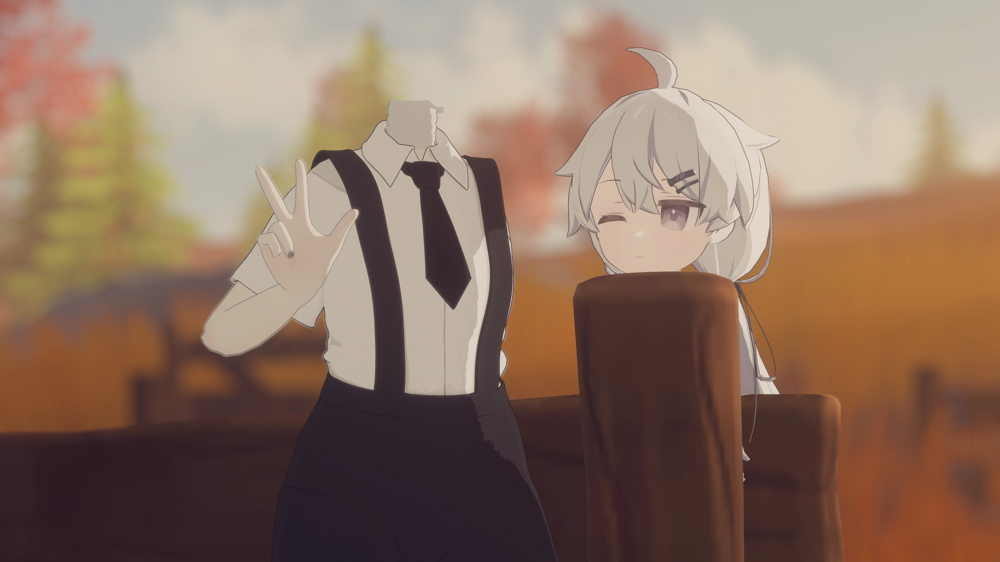 
  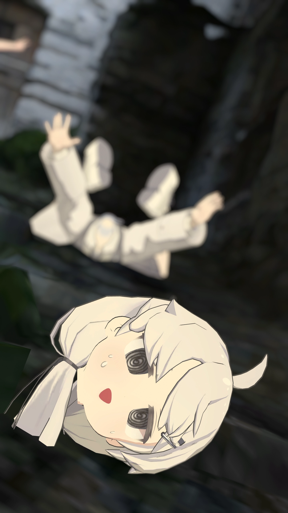 
  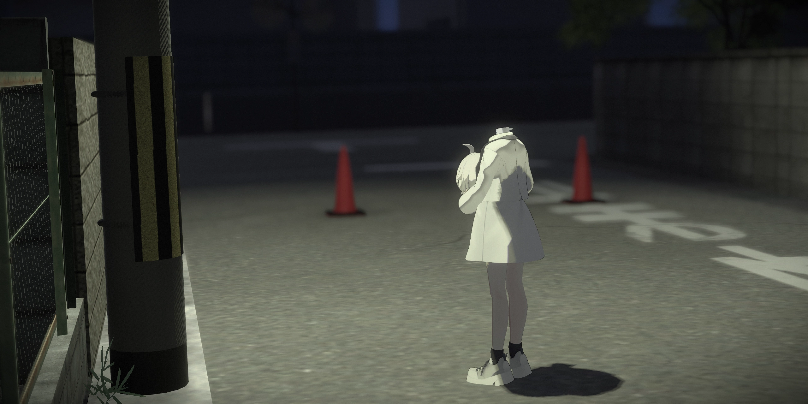 

## 更新日
2025/10/03  アウトライン製作