+++
date = '2026-08-11T16:58:52+09:00'
draft = false
title = 'のっぺらぼうのプラチナちゃんの資料'
slug = 'Platnium_noperabou'
tags = []
categories = []
image = 'Main.webp'
comments = false
+++

## トップビジュアル
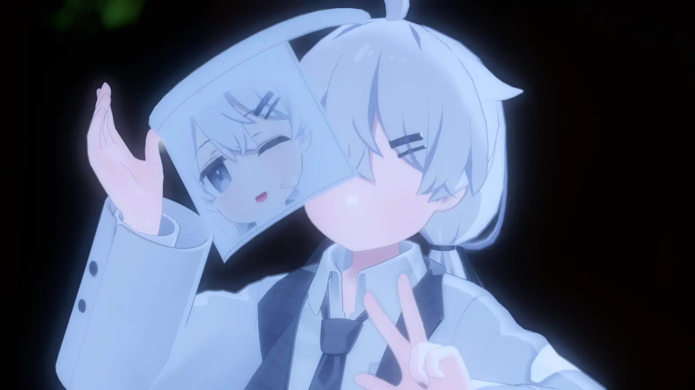
## 基本情報
- アバター名
Platnium Noperabou
- モデル出典: https://mk22.booth.pm/items/3950859
- 対応:PCのみ,Very Poor
- 権利関係の注記
このアバターは「ぷらすわん」様制作のモデルを購入・利用し、衣装やテクスチャなどを改変したものです。  
元モデルの著作権は制作者に帰属します。  
改変部分は私個人の利用のために作成しており、再配布は行いません。  
本ページに掲載しているスクリーンショット・画像の無断転載はご遠慮ください。   
Skebなど依頼時の資料としての閲覧・参照は問題ありません。  
モデル制作協力及びギミック製作協力、テクスチャ作成を手掛けていただいた、[Momonger](https://x.com/Black_Momonger)氏に多大なる感謝を申し上げます。
## 全身・回り込み資料
### 3面図(ベール?あり)
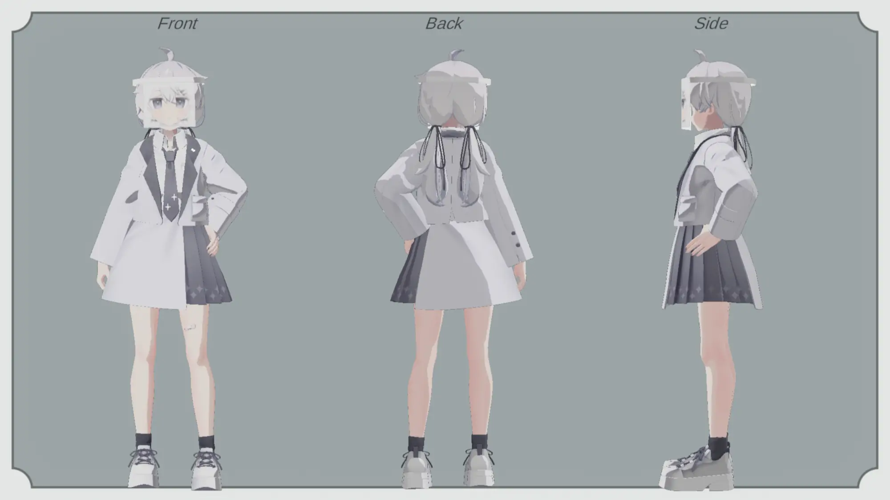
### 3面図(ベール?なし)
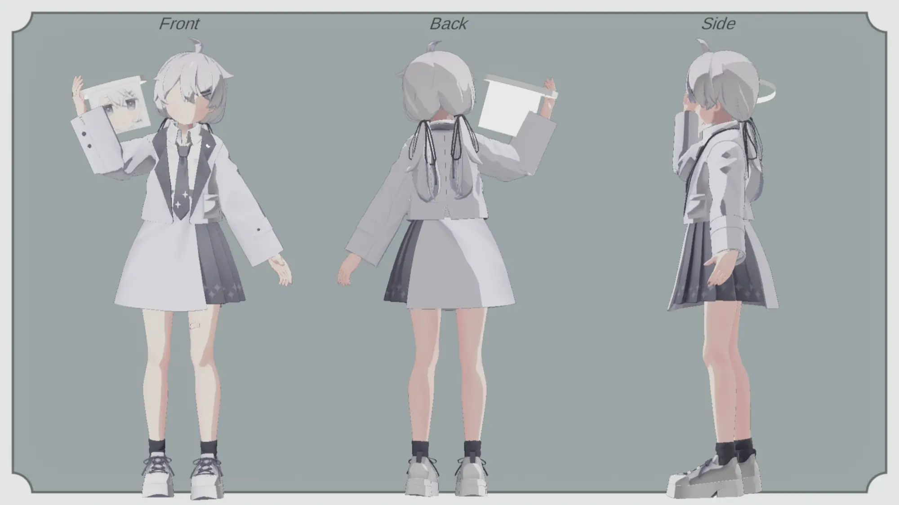
## 表情集
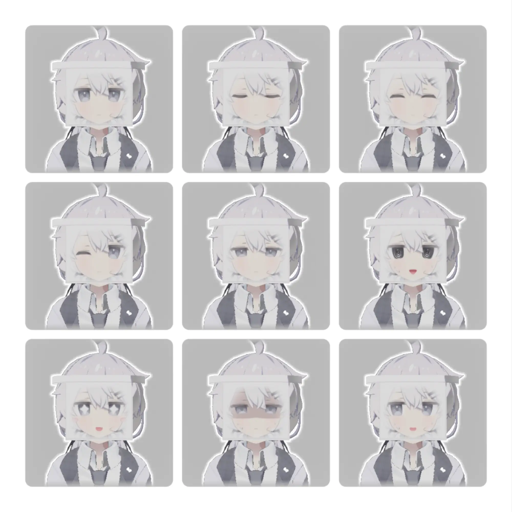  
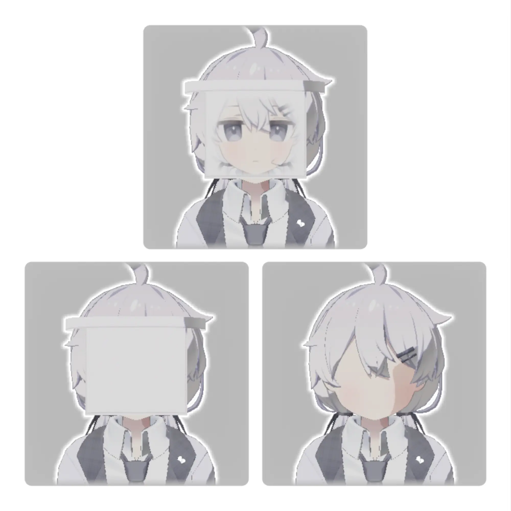  
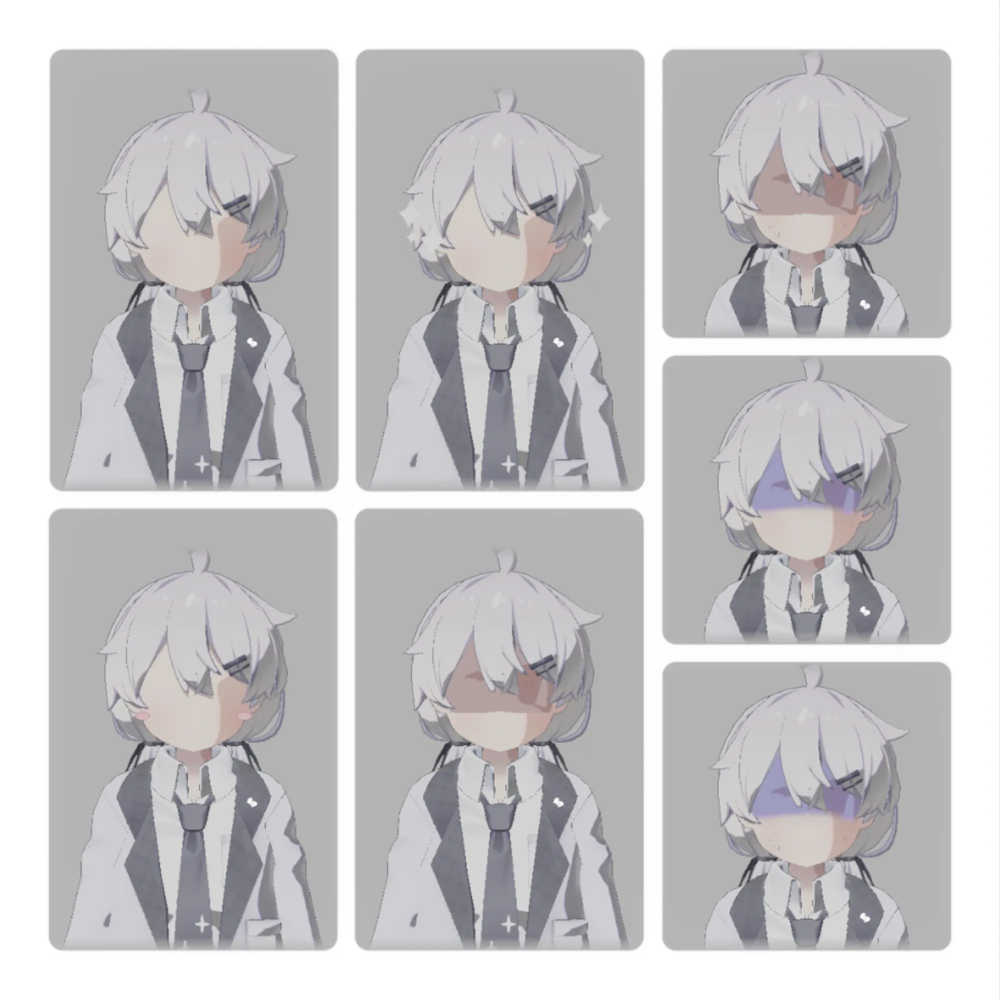  

## ツール
- 帽子ギミック  
https://booth.pm/ja/items/4977797
- 影  
https://booth.pm/ja/items/5135844
- 明るさ調整  
https://booth.pm/ja/items/4864776
- ユーティリティツール(座り姿勢、足固定など)  
https://franada.booth.pm/items/3290806
- ポーズ固定ギミック
https://zerofactory.booth.pm/items/5989814
## 改変・独自要素
顔が無いです。のっぺらぼうなので。


顔が無いだけじゃ面白くないので、「[どっかのアバター](https://onlyone00001.booth.pm/items/8638536)みたく顔のパーツを取る」ではなく、ベール?に表情を出してます。
ベール?にはハンドサインによる表情と、a,i,u,e,oに対応した簡易的なLipsynkが付いてます。  
~~どっかのアバターとは違うのだよ!~~    


ベール?は取れます。だいたいデュラハンの頭と同じように扱えます。  
```帽子ギミックなのに使ってるのが帽子以外なのは内緒で...```  
声はベール?側ではなく、体側から出ます。ベール?側から出してほしい人がいればそうするかも?  


のっぺらぼうで顔が無いですが、簡単な表情を付けました。(表情集内の3枚目写真より)  
「コレって表情?」って思いますが、一応青ざめとか頬染めが有るので表情です。  

## 衣装
### デフォルト衣装
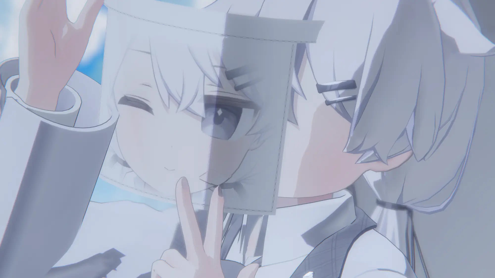  
### 浴衣(Monotone)
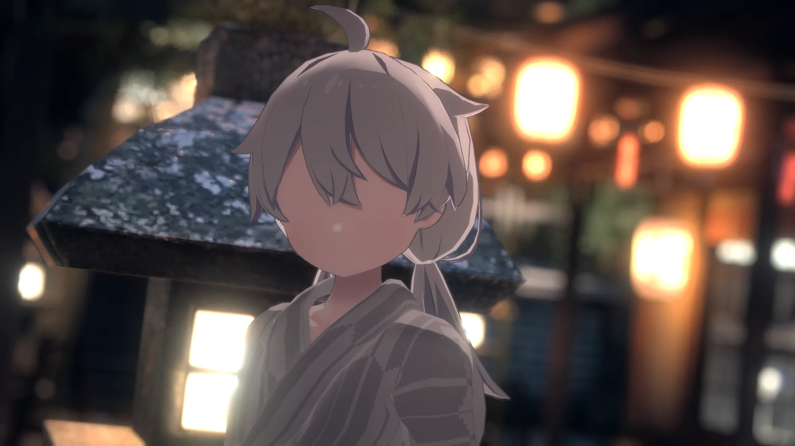
## 裏話
またもや妖怪シリーズです。前作は、幽霊->デュラハンとなってろくろ首だったので和洋のバランスが取れていました。まぁ今回のコレで崩れたんですがね。
まぁ概ね、「面代ちゃん」とか「Coffee talk Tokyo」辺りが原因です。~~「じゃあ何故新しく作った?」とか聞くなよ?~~  


地味に製作が大変でした。顔部分を作るのに**半日**程度掛かったのに対して、ベール?部分の制作に**2日**かかりましたからね。4倍ですよ4倍!  
帽子ギミック内のFXレイヤーに表情、Lipsynkを組み込むという狂気の仕様だったのでしょうがないと言えばしょうがないんですが。  


下からしっかり覗いたり、横から見ると有るべき場所に有るべきパーツが無いという若干の恐怖演出っぽい物もあります。まぁ通常使用の内ですが。 


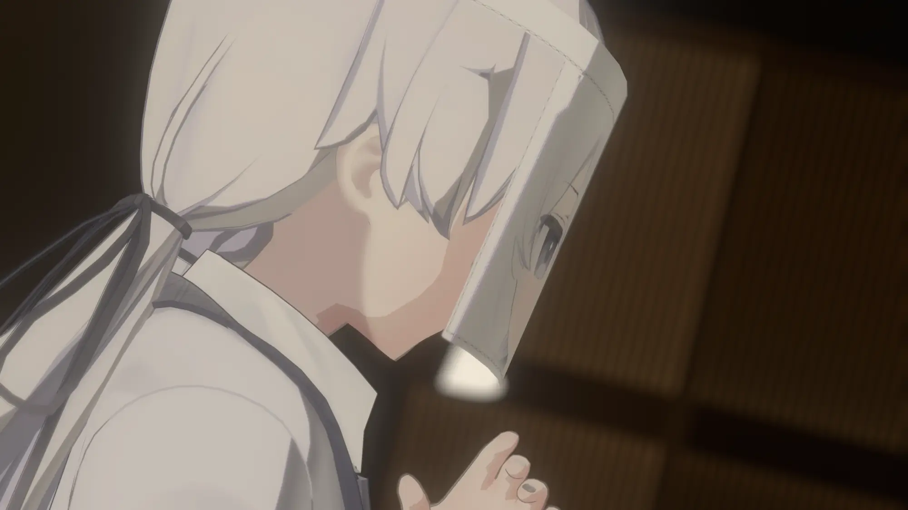  


[こういうグッズ](https://booth.pm/ja/items/6035124)とは違ってしっかりパーツが無いので面白いです。  
むしろこういうのが有るおかげでこの改変が映えますね。一部の人が勘違いを起こすので。
## Q&A
- Q. 表情集って言ってるけどコレって表情なの?
  - A. 私にもわからん。
- Q. ベールって他人が弄れないんですか?
  - A. デュラハンと同じなので、顔に付いているときは弄れません。
  - ワールド固定したりしてるときは弄れます。
  - 捲ることはできません。構成考えるのが面倒なので。
- Q. なんでここまで苦しんでまでLipsynkを?
  - A. **Lipsynkが有った方が色々と良いじゃないですか!**
  - 口パクって以外に馬鹿に出来ないんですよ!
- Q. なんでのっぺらぼうを選択したの?
  - A. 良いなって思ったので。
  - アバターの面代ちゃんとか、Coffee talk Tokyoのマコトなど、最近触ったコンテンツで良いキャラが多かったので。
## ギャラリー
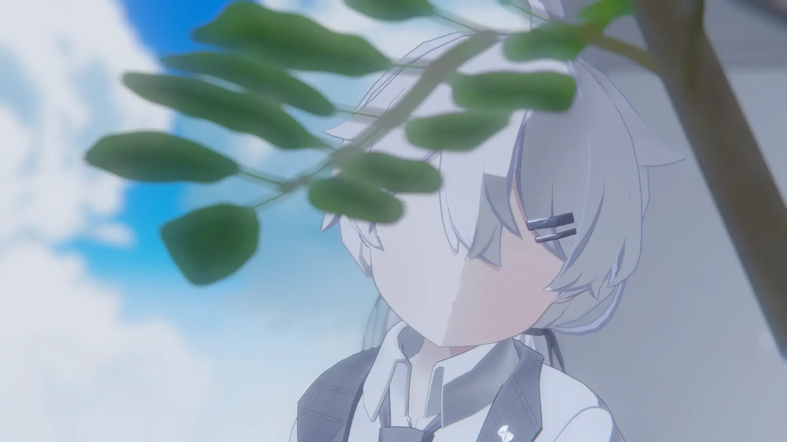  
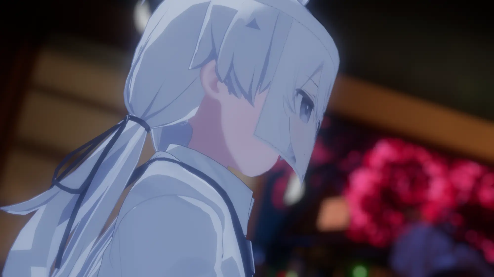  
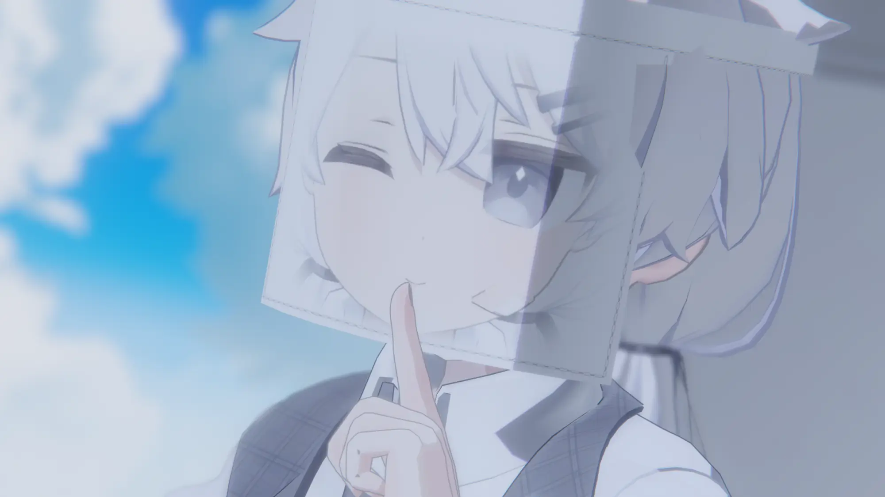  
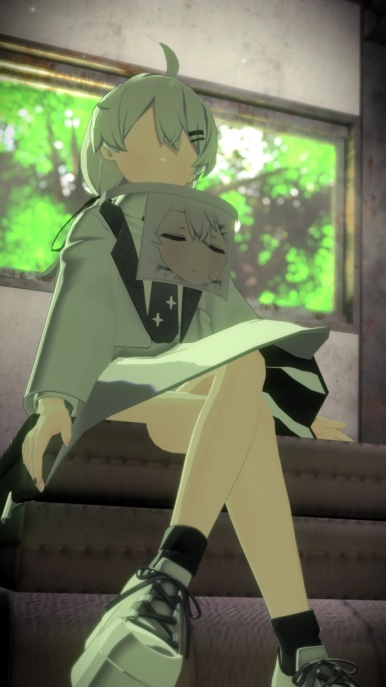  
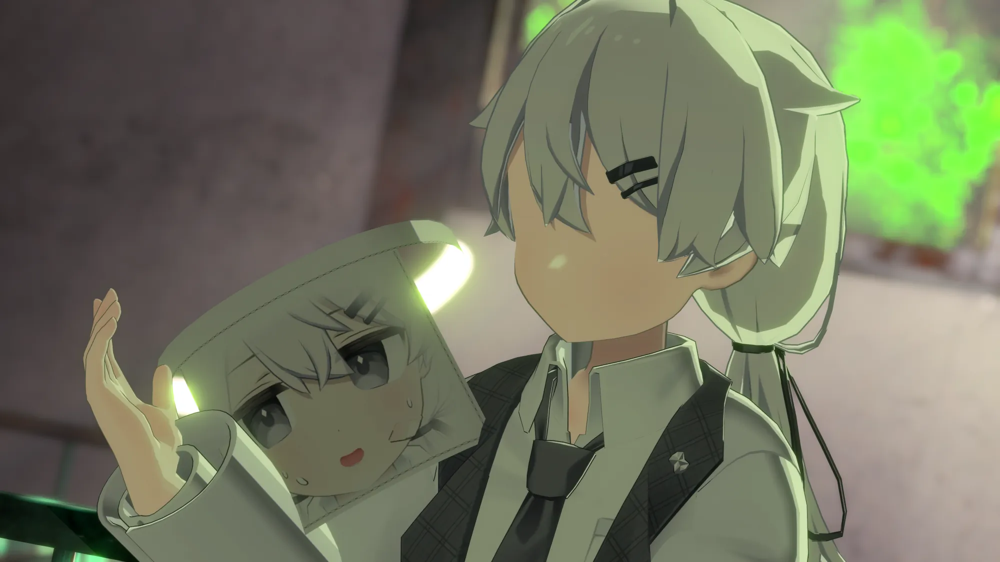  
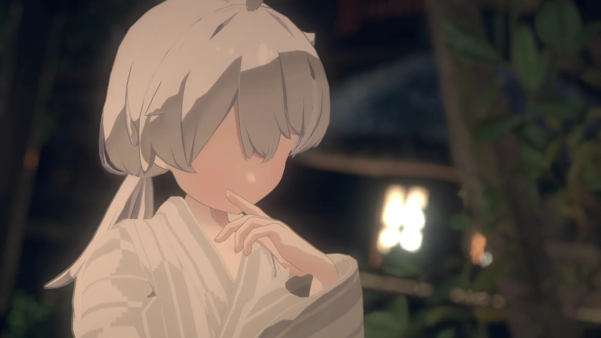  
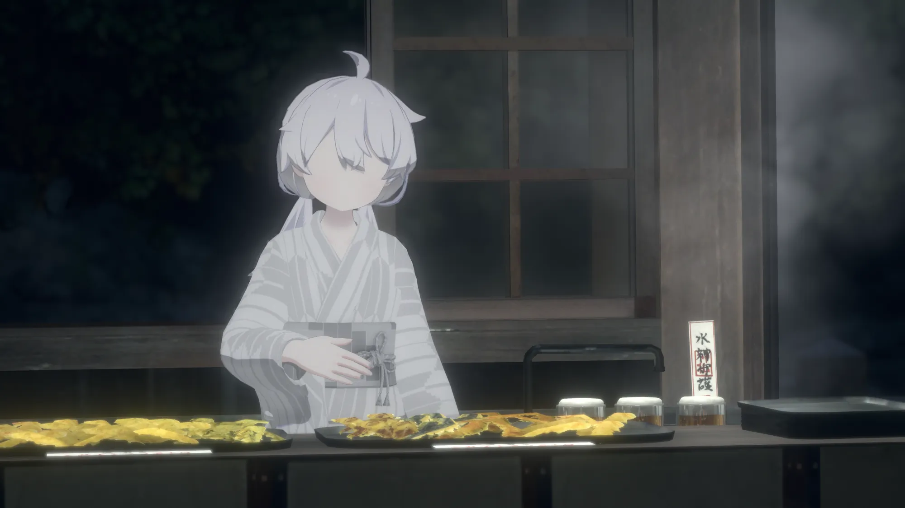  
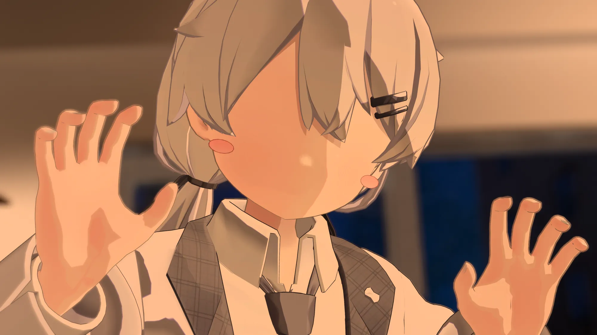
## 更新日
2026/08/11   初版作成
2026/08/26   特殊表情の追加