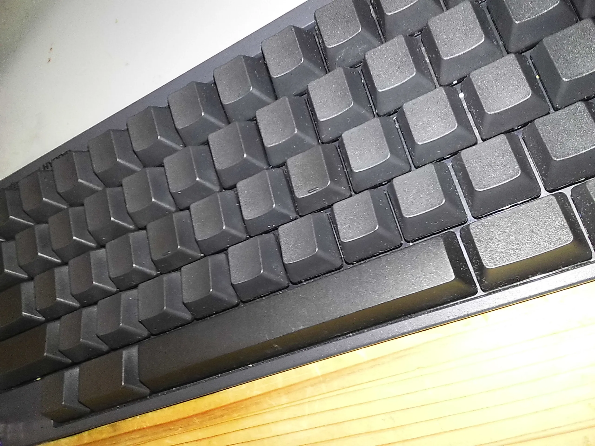

+++
date = '2025-11-26T20:23:17+09:00'
draft = false
title = 'Instax mini liplayを買った話'
slug = 'Buy_instax_liplay'
tags = ["photo","雑記"]
categories = ["photo","雑記"]
image = "1764134051245.webp"
comments = true
+++
## はじめに
どうもこんにちは、pi-tyakuです。  
いつの間にか秋が終わり、冬を感じさせる寒い日が多くなりました。  
今回は、FujiFilmのInstax mini Liplayを衝動買いしてしまったので、紹介兼ベンチマークをしていきます。
## なぜ買ったのか?
**たまたま入ったブックオフでコレが安く売っていた**からです。理由はコレだけ。  
ブックオフでコレを見つけた時、「お得!」と思いました。Instax mini liplayが1万円で売られているんですもん。実際、カメラのキタムラやメルカリの中古では1万4000円くらいで売っているのでお得と言えばそこそこお得でした。  
しかし、チェキのフィルムが入手しづらいので即決はしませんでした。その後、近くのカメラ屋を巡った際に、チェキのフィルムが販売されていました。何故。  
カメラ屋でフィルムを手に入れてしまったので、覚悟をキメて購入しました。  
丁度、私が「**人生の重大イベントの区切りがついた**」のと「**そのイベントのせいで気が狂いそう**」な状況だったのでこの衝動買いを止められませんでした。無念。  
しかしながら、「人生初のデジタルで保存されるカメラ」＋「動くインスタントカメラ」を手に入れたので悪くない選択だった可能性が有ります。まぁ購入初日では分かりませんが。
## 外見
今回のカメラです。  
  
カラーはエレガントブラックですね。どこら辺がエレガントなのかは分かりかねますが。
## 写真
今回は「このカメラで撮影した写真」と「このカメラで印刷した写真」を載せます。
何かの参考になれば幸いです。
### カメラで撮影した写真    
  
### 印刷前の写真

### 印刷後の写真

## まとめ
というわけで新しいカメラを買ってしまいました。  
また量が増えてきたら`photoタブ`に追加しておきます。