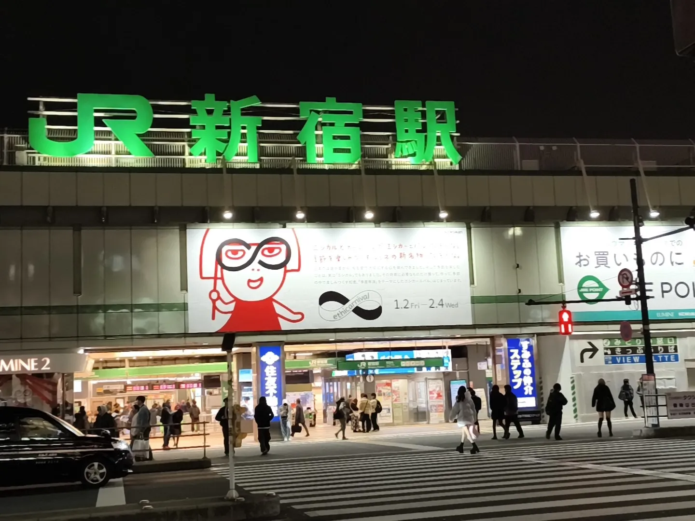
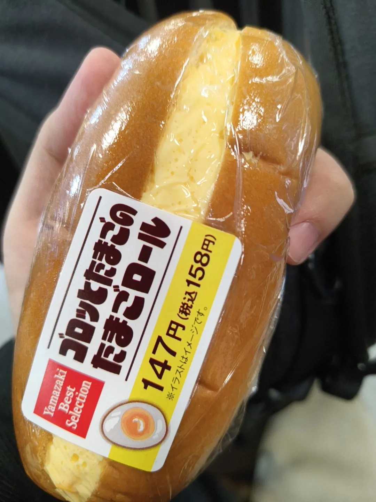
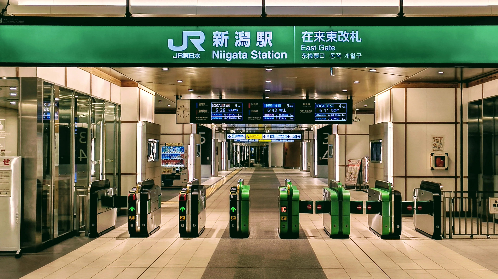
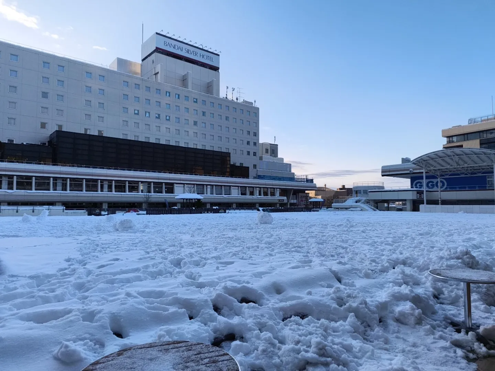
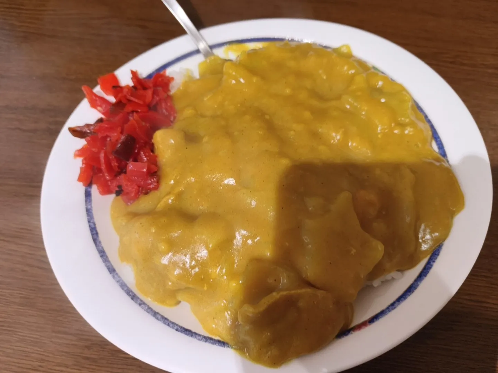

+++
date = '2026-02-04T22:03:39+09:00'
draft = true
title = '教習所に行った話 day0'
slug = 'Driving_Scool_day0'
tags = ["雑記"]
categories = ["雑記"]
image = ''
comments = true
+++
## 初めに
どうも、pi-tyakuです。最近、このサイトの内容が雑記寄りになっている気がします。まぁ今回も雑記ですが。  
というわけで、今回は自動車学校に行くまでの話をしようと思います。
## 何故こんな話を?
この前、こんなツイートを投稿しました。  
<blockquote class="twitter-tweet">
ここ2week程度出かけます VRCにはVRで入れないと思いますが写真投稿のストックは準備済みです
&mdash; tyakuma (@4KpB5_u_44dyr2b) <a href="https://twitter.com/4KpB5_u_44dyr2b/status/2015613614691065999?ref_src=twsrc%5Etfw">January 26, 2026</a></blockquote> 
まぁ割と不穏ですね。  
この題名でこのツイートを扱っているということは、2week程度出かける予定が自動車学校に合宿に行くことを表すわけです。
というわけで、自動車学校に行った際のログと、実際に教習を受けてきたログを残すためにこれらのページを書き残します。  

## 第0日目
### 夜行バス直前
というわけで、教習所の前日となる第0日目は、教習所に行くため、夜行バスに乗りました。
「どうして夜行バスに?」って？教習所の集合時間が早すぎて公共交通機関が使えなかったからです。「お金がない」わけではないです。
集合時間がだいたい9時半くらい、新幹線の始発でも間に合いません。なので夜行バスを使ったわけですね。  
というわけで、最寄り駅を出発して0時頃、新宿駅に到着しました。いやはや...厳しい。深夜に電車移動するだけでもここまで堪えるとは。  
  
前途多難さを感じ始めた所で、軽く夜食を購入し、食べておきました。やたらと美味かったな、デイリーヤマザキの卵コッペパン。  
  

### 夜行バス(1つ目のサービスエリアまで)
軽く腹を満たした所で、夜行バスが到着し、乗り込みました。  
今回は3列シートを選択したのですが、思っていた以上に狭く、暑く、音を立てることを許さない感じがしました。個人的に一番辛かったのは、**音を立てることを許さない感じ**ですね。なんというか、全員の心の余裕を感じられない感じがして辛かったですね。
というわけで、静かに大人しくしつつ、睡眠を取ろうと思いました...が寝られません。車では結構寝やすい方では有るのですが、環境に慣れていないのと地味に暑かったのが重なって1つ目のSAまでは全く寝られませんでした。  
### 夜行バス(2つ目のサービスエリアまで)
というわけで、寝られないまま1つ目のSAに着きました。「夜行バスって結構地獄だな?」と思いつつ御手洗や水分補給をして、自分の席につきました。なんと奇跡的に1つ目のSAから2つ目のSAの間では少し眠ることができました。暑さが和らいだのか、それとも睡眠用BGMをEar(2)で流していたからか、どちらかは分かりませんが眠れたのは事実です。残念なことに、コレが当日最後に良く寝られた時間でしたが。
というわけで、2つ目のSAに到着しました。急に明るくなって「何だ?」と思ったら2回目の休憩でした。疲れていたのでSAには行きませんでしたが。
### 夜行バス(到着)
少し眠れた時間と休憩が過ぎ、段々と降りる人がぽつぽつ出てきました。目的としていた駅まで幾らか停まっていたのです。コレがまぁ安眠を妨げる。如何せん停車すると降りる駅かどうか気になってしまうわけですねコレが。なので少し眠り、起きて確認しを繰り返して目的の新潟駅に着きました。
「もう2度と夜行バスは使わない」と決心するレベルで寝られませんでした。まぁ夜が苦手なのに移動するのがよろしくないのですが。使うとしても昼行便を使いますね。
### 朝の新潟駅
というわけで、朝の6時台に新潟駅に着きました。寒い。  

このまま新潟駅構内で待っているのも選択肢ではありますが、流石に朝の駅中で3hも待っているのは現実的ではありません。  
というわけで、適当に飯屋とかが開くまでの時間をカラオケで潰すことにしました。本当は漫喫とかが有ればそこで時間を潰すかと思いましたが、流石新潟駅、一切ありませんでした。というわけで、荷物を適当に預け、24hやっているカラオケに向かいました。
流石カラオケ、暖かい。適当に頼んだ暖かいココアと共に夜行バスで固まった体をほぐしました。流石に歌ってはいません。体力状況的に厳しいので。
### バスセンターのカレー
というわけで、時間を潰して朝の7時半になりました。カラオケを出て、寒い中朝ごはんをどうするか考えました。新潟の米を使ったおにぎり屋さん、駅構内のそば屋、どれも素晴らしいチョイスですが、新潟には面白い飯が有ります。それがバスセンターのカレー、普通のカレーよりも黄色く、豚骨スープで伸ばした面白い風味のカレーが食べられるそう。[ある人の動画](https://www.youtube.com/watch?v=ohsxhRnIzmI&t=334s)で気になっていたことと、朝からやっていることを考えた結果、バスセンターのカレーを朝ご飯にチョイスしました。
カラオケから雪道を歩いて10分、万代バスセンターに到着しました。寒かったし危なかった。  
店が開くまで20分程度あるのでバスセンターの周りをウロウロしたり、列に並んだりしながら待ちました。流石に時間が早かったのか、人は1人しかいませんでしたが。
というわけで、待つこと20分、店が開いたので食券を購入しカレーと対面しました。  
  
黄色い。本当に黄色い。写真では分かりづらいが本当に黄色いのだ。今まで食べてきたカレーと違った色が来ました。分かってはいたが黄色い。そしてスパイシーながらもコクが有って旨い。朝方かつ空腹なのもあって熱いカレーをホフホフとほおばりました。とても良かった。  
### そして1日目へ...
カレーを満喫し、駅に戻り、目的の電車の時間まで待ちました。
ココから教習が始まります。何が起こるのか全く分かりませんがなんとかなると思っていました。
[1~7日目編](/content/post/Driving_Scool_day1~7/index.md)へつづく。
