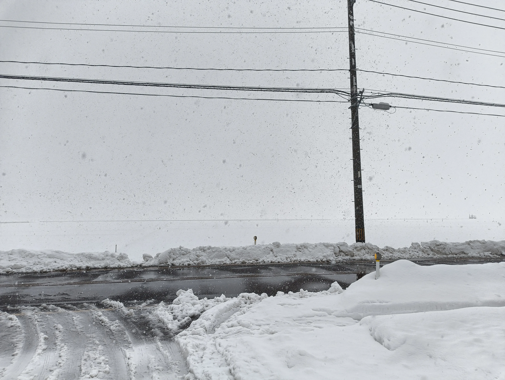
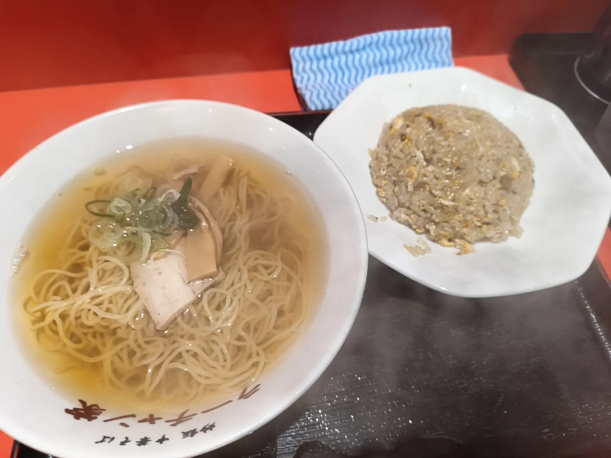
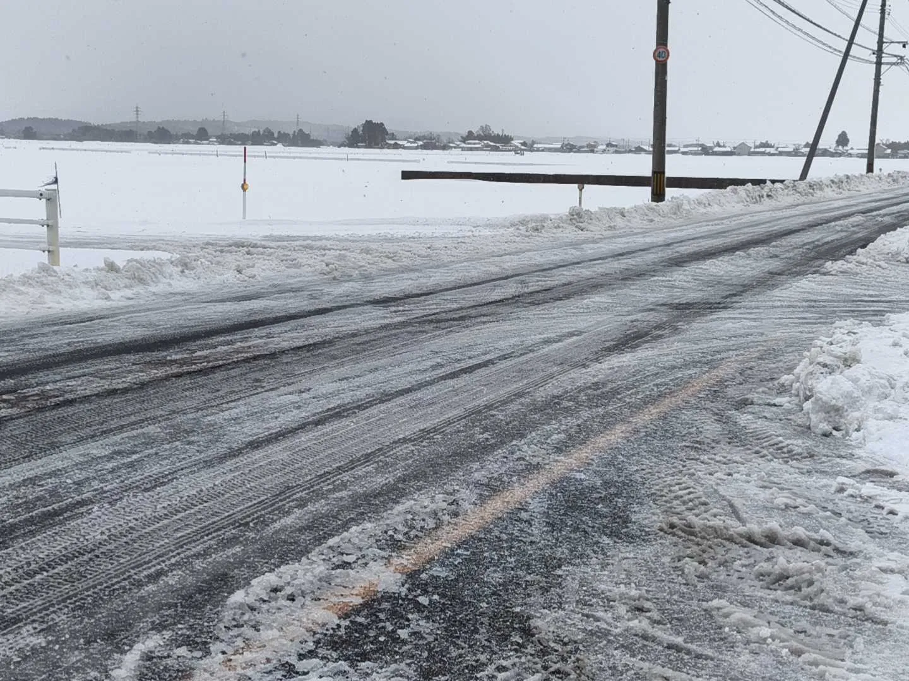

+++
date = '2026-02-04T22:04:00+09:00'
draft = true
title = '教習所に行った話 day7~day14'
slug = 'Driving_Scool_day7~14'
tags = ["雑記"]
categories = ["雑記"]
image = ''
comments = true
+++
## はじめに
[前回](/content/post/Driving_Scool_day1~7/index.md)に引き続き、免許を取っています。修了検定までも厳しかったが、これ以上の辛さと面白さを含む後半編となります。
## 7日目
修了検定が終わり、仮免許を手に入れることができた。
が、外の景色は結構な雪模様。「こんな状況で路上に出るのか？」と思いましたがバリバリ3時間出るらしい。厳しすぎるだろ。  
  
というわけで、やった内容は次になる。
- 点検
- 路上走行
- 夜間走行
- バイパス進入
- 渋滞対応
なんで路上出て1日も経ってない奴が、結構な雪が降る中バイパスに出て60㌔も出さなきゃいけないのか。「もっとだしましょうね～」じゃないのよ。ついでに終わりが19:50なのも何なのだろうか。個人的には路上教習の一日目どころか零日目の奴の内容とは思えない。とても疲れた。
## 8日目
取り敢えず激動の一日目が終わり、2段階目の2日目に入る。昨日は昨日で忙しかったが今日もかなり忙しくなりそうだ。
というわけで今日やったことは以下になる。
- 商店街ルート走行
- 救命講習
午前3時間と救命講習3時間だ。多い。午前に関しては言うことは無かったが午後の救命講習も相まって結構ハードだった。
救命講習は特に言うこともなく終わった。強いて言うなら心臓マッサージ時に込める力が強すぎて若干怒られた位か。[フィットボクシング](/page/content/post/fitboxing/index.md)の成果が出てしまったのか?
## 9日目
というわけで忙しかった7,8日目を過ぎ、日程的には比較的優しい日程のはず?
というわけで今日やったことはこうなった。
- 駐停車
- 駐停車ルール
- 霧時の走行
- 車の日常整備
- 効果測定
日程だけを見たら優しい日だったが、効果測定の期限が明日という急なタイミングだった。「噓だろ！第一段階じゃ6日目に回収していたのに!」って思った。  
しかし、第二段階の一日の教習上限が3時間、第一段階の教習上限が2時間となっている。  
フルで授業を入れ、11回目の教習で効果測定を提出する場合、第一段階だと11回目の教習は6日目、第二段階だと3日目というわけだ。  
なので死ぬ気で効果測定を終わらせた。VODを見ている間にパターンを覚えながらやった。  
「7,8日目にやっておけば良いのに...」だって?朝8時から夜20時と朝9時から夜19時まで授業をやるのにどこのタイミングでやるんだ。
まぁともかくこの3日間が一番忙しかった。
コレは余談だが、このタイミングで[ココ](https://vr-lifemagazine.com/goods_pi-tyaku/)の記事の調整や「反応をしてくれ！」などのイベントが有った。  
なんというバットタイミング！非常に面倒ながら対応した。私えらい。
## 10日目
効果測定を終わらせ、記事の調整も終わらせ、泥のように眠った翌日。  
なかなか厳しい感じがする。が、日程から見ると一番優しい日程なので頑張ることにした。
というわけで今日やったことは次の通り。
- 切り返し
- 縦列駐車
- 急ブレーキ
皆さんのトラウマ2ndシーズンだ。個人的には面白いが、「教習所のポールを参考に縦列駐車したところで路上では役に立たないのでは?」という気持ちが強い。とりあえず実家で練習することにしよう。  
また、新潟駅の方に行った。「駅前のヨドバシカメラにLomographyのフィルムの取り扱いが有れば買いたい」と思ったのと、「ラーチャン屋が気になるな?」と「おにぎり食べたい」という欲求を満たすために行った。
結果から言うと駅前のヨドバシカメラではLomoのフィルムの取り扱いはほぼ無く、購入しなかったが、それ以外は達成した。特にラーチャン屋のチャーハンは美味しく、結構よかった。  

駅前のヨドバシカメラは許さん。[Webサイト](https://www.lomography.com/about/stores?country=jp)を参考にして向かったのに。

## 11日目
少しリフレッシュができた昨日に続いて今日もやっていく。
というわけで今日やったことは次の通り。
- 危険予測
- 複数教習
みんな大好き危険予測。シミュレータで理不尽な動きをする人間を轢かないようにするアレ。
今回は~~残念なことに~~人を轢かなかったが、現実環境では人を轢かないようにしたい。だからといって歩道がアレだから車道を歩くのは辞めてもらいたい。危ない。
## 12日目
とりあえず今日もやっていく。効果測定云々とVODが終わると一気に暇になる。
というわけで今日やったことは次の通り。
- 経路走行
- 高速道路走行(シミュレーター)
高速道路はシミュレータでやった。80km/h出すのは結構面白い。~~強風に煽られてぶつけたのは内緒だ。~~ハンドル操作は難しい。

## 13日目
最後の方に行くと書くことが無くなっていく。暇になるとともに、この合宿の終わりを感じる。
というわけで今日やったことは次の通り。
- 複数教習
- みきわめ
今回もみきわめ教習が有った。今回も特に言うことは無し。とりあえず問題なく通過出来たのは良かった。
## 14日目 卒業検定
最終日、この日の成績が悪いだけでn万円も飛んでいくと考えると非常に憂鬱だ。
というわけで本日は卒業検定。卒業検定は、「路上に出て教官の指示に従って走行するフェーズ」と「場内で縦列駐車or切り返しを行うフェーズ」に分かれている。  
私が運転する順番は3人いる中での1番目、教習所から出て最終的に路上に止まるルートとなる。  
天候は雪＋路面状況も雪と凍結の最悪だった。  
  
それでもやるしかない。こういうところが合宿免許の悪いところだ。  
心の中で文句を垂れつつ、私は車に乗り込み、卒業検定が始まった。「怖い」、この一言に尽きる。路上教習でも無かったくらいの路面の悪さ、そして卒業検定という緊張感、こんな状況では60㌔制限の道路で40~50㌔しか出せるわけが無い。更に、変なところに居るゴミ収集車、線を覆い隠す雪山。本当に合格できる気がしない。  
更に最終の停車の際、教官に「お前ここに停車していいのか?」って言われる始末。勿論その場から確認し、少し前の場所に停車をして卒業検定は終わった。最終的に分かったことだが、最初に停車していた位置は駐停車禁止の区間だった。雪で分かるわけねぇだろ。  
ともかく、終わった後は最悪の気持ちになった事は明白だろう。その後の2人の運転中は落ちたもんだと思っていた。
がしかし、2人目の運転中、大きめのインシデントが起きた。2人目の奴は交差点を右折する際、交差点内に侵入し、自分の進行する方の信号が赤になったのを確認して、**交差点内で停車した**のだ。更に、したことの重大さに気が付いたのかどうかはわからないが、「交差点外に出る」為にあろうことか**バックしやがった**のだ。基本的に、「交差点内は直進する車を待つ以外では停車してはならない」というルールが有る。更に、「交差点内から交差点外に出る」為にバックするのは言語道断レベルの行動だ。本当にびっくりした。一発で検定中止になってもおかしくないが、検定中止の言葉は教官から出なかった。  
ともかく、路上フェーズを終え、場内に戻って縦列駐車をした。私は一発で縦列駐車を成功させた。因みに交差点内で停車した野郎も縦列駐車をしていた。合否がわからないというのも考え物だ。
全てのフェーズを終えて、教官からのアドバイスを貰った。「貴様はもっと法規運転をしなさい。もっと交通法規を勉強しろ。」と滅茶苦茶に怒られた。まぁ駐停車禁止の区間に止めようとしたらそら怒られるわな。先ほど書いた「最初に停車していた位置は駐停車禁止の区間だった。」の部分はココで教えられた。  
アドバイスももらい、1時間程合否を出すためのお昼休憩が入った。流石に精神的疲労とストレスでお昼の味が分からなかったが、何とか胃の中に押し込んだ。ココまで気分の悪い昼食は人生で初めてだ。出来る事ならもう二度と味わいたくは無い。  
気分の悪い昼食も終わり、合否発表となった。気分の悪い顔を上げながら、合格者の受験番号が表示されるスクリーンを確認した。なんとそこには私の番号が有った。なんと合格していたのだ。「あそこまで詰められていたのに受かっているのか...」と思ったが合格は合格だ。やっとこの地獄から抜け出すことが出来る。本当に、本当に良かった。  
ついでに言うと、交差点内で停車した奴の受験番号は勿論表示されていなかった。そいつは「どうして俺が落ちるんだー！！！」的な事を言っていたが原因は明白だ。大人しく追加講習を受けてさっさと再試験を受けてほしい。
## 終わりに
というわけで2週間分のレポート?を書き終えた。本当に、本当に、辛く長い2週間だった。
逃げ出すことも、休むことすらままならない2週間だった。  
次が有るとしたら、学科試験編になるのかしら...正直なところ書く気力が沸けば書くと思う。
ココまで長々と読んでいただき、ありがとうございました。