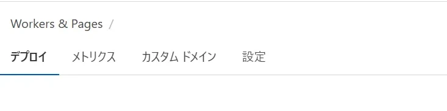

+++
date = '2025-09-25T08:56:02+09:00'
draft = false
title = 'CloudFlare Registerでのドメインの取り方'
slug = 'How_to_get_Domain'
tags = ["Tech"]
categories = ["Tech"]
comments = true
image = "CF_logo_stacked_blktype.webp"
+++
## 初めに
今回はCloudFlare Registerを利用して独自ドメインを取得し、CloudFlare Pagesを独自ドメイン対応にする方法をまとめます。
今回は流石にターミナルの出番は無いです。
## 前準備
初めにCloudFlareのアカウントを作成しておきます。
流石にアカウントの作り方は省略させていただきます。
それ以外は、特に準備はありません。
## 何故CloudFlareなのか?
全てをCloudFlareで構成しているからです。
それ以外の理由としては、他のサービスより安価だったりもあります。<br>
お名〇.comとかは1年間無料とかも有りますが、「更新費用が高い」、「メールがやかましい」、「値上げする」等の難点が有るので非採用にしました。<br>
CloudFlaereならレジストラを提供している側なので手数料が無料でドメインを取得できます。コレには原価厨もにっこりです。さらに更新時に追加で手数料がかかることも無いのでだいたい1年目と同じ値段で購入できます。<br>
さらに現在はこのページをCloudFlare Pagesを利用してページをデプロイしています。なので相性及び導入が簡単なので選びました。

## CloudFlare Register
初めに、CloudFlareにログインし、アカウントのダッシュボードに入ります。<br>
そこで、左側のメニュー内の"ドメインの登録"内の"ドメインの登録"を選択します。<br>
<br>
そのページで取得したいドメイン名を入力します。トップレベルドメイン(.comとかのやつ)は入力しても、しなくても問題ないです。<br>
ドメインの被り等が無ければ、取得年数と取得者情報と支払い方法を記入する画面に進みます。<br>
取得年数に関しては、取得年数を過ぎた場合でも自動で更新されるので、よっぽど円高の時以外は自由に選択して問題ありません。<br>
また、取得者情報で記入が必要な部分は、
- 氏名
- メールアドレス
- 電話番号
- 住所

となります。<br>
これらの情報を入力して購入を確定するとドメインを取得できます。

## 独自ドメインとCloudFlare Pagesの紐づけ
自分のCloudFlare Pagesの設定画面に入ります。<br>
その中の"独自ドメイン"タブに入ります。<br>
<br>
そこで"独自ドメインの設定"を選択し、ドメインの入力画面に進みます。<br>
ドメインを入力し、手続きを進めると自動でDNSの設定が完了します。

## Hugoの設定
コレで、先ほど取得したドメインから自分のページに、アクセス出来るようになりました。しかし、ページ移動すると元のアドレスの場所を指定してしまうのでHugo自体の設定が必要になります。<br>
ページ内のConfig.yamlかhugo.toml等の設定ファイルを開きます。<br>

```config.yaml
baseURL: "Your site domain"
```

## CloudFlare Pagesの元ドメインを独自ドメインに転送する
コレでCloudFlare Pagesとhugo内で殆ど自分のドメインを利用する事が出来ました。
しかし、「元々のドメインにアクセス」した際にそのままアクセス出来てしまいます。<br>
どうせなら「元々のドメインにアクセス」した時に自動で取得したドメインに飛ばしたいですよね。<br>
というわけでCloudFlareの一括リダイレクト(Bulk Redirects)を利用します。<br>
CloudFlareのダッシュボードにアクセスして一括リダイレクトを選択します。<br>
<br>
一括リダイレクトリストの作成と一括リダイレクトルールの2つがあるので、初めに一括リダイレクトリストを作成します。
一括リダイレクトリストの作成をクリックします<br>
<br>
リストの名前を設定します。説明も適宜書いてください。<br>
<br>
リダイレクトするURLを追加します。CSVで記述済みの物をアップロードするか、手動で記入のどちらかが使えます。今回は手動で追加します。<br>
ソースURL(移行元のURL)とターゲットURL(移行先のURL)を記入します。
場合によってはHTTPステータスコードも変更してください。<br>
今回はこの様になります。<br>
<br>
pi-tyaku.site.pages.devをpi-tyaku.comに変更しました。ステータスコードは301(永久的な移行)を指定します。<br>
保存とレビューが終わったらルールの適用をします。<br>
一括リダイレクトルールの作成をクリックします。<br>

ルール名とリダイレクトリストを選択して保存します。<br>
<br>
コレで元のドメインにアクセスした際、HTTPステータスコードの301番を返し、今のドメインに移動します。<br>

## まとめ
今回はCloudFlare Rehgisterを利用したドメイン名の取得方法とCloudFlare Pagesなどに適用する方法をまとめました。
この記事を通じてドメイン取得の手助けにして欲しいです。