+++
date = '2026-04-22T19:11:29+09:00'
draft = false
title = 'デュラハンアバターの作り方'
slug = 'How_to_make_dullahan_avater'
tags = ["tech"]
categories = ["tech"]
image = ''
comments = true
+++
## 初めに
どうも、pi-tyakuです。今回は、VRC上でデュラハンギミック(首が取れるギミック)の作り方を説明する。

## おことわり
本改変は、非常に難しい改変となっている。  
前提として、「MA」、「Blender操作」、「VRCの仕様」、「FXレイヤの知識」、「最低限のプログラミング知識」などが分かっている前提で紹介する。  
分からない言葉や操作に関しては、適宜公式のリファレンスや他解説ページを参考にしてほしい。  
また、Unityオンリーで同じ改変をする場合は、ミカンの置物様の[誰でもデュラハンギミック](https://m1m1m1k4n3.booth.pm/items/7612724)を使用することをお勧めする。  
また、Blenderが必要となる作業は終わらせている前提で解説する。

## 簡単な仕組みの解説
帽子ギミックの帽子を頭に置き換える。  
簡易的な仕組みとしては次の通り。
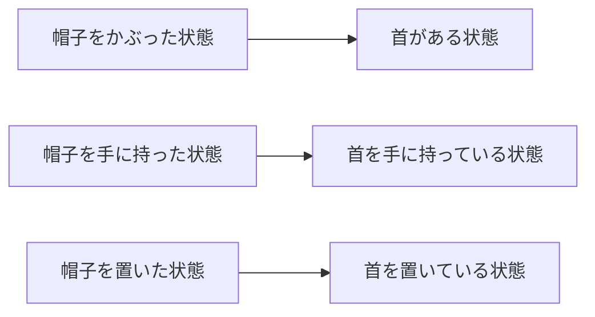
として置き換える。
帽子ギミック本来の機能を活用し、VRC上でデュラハンのように首を取れるようになる。

## 前提として必要なもの

### Blender操作が必要なもの
#### 改変用アバターの首(首より上)(髪の毛を**含まない**)のみのファイル
FBXファイルで出力しておく。
BodyのブレンドシェイプとかがそのままならOK。  
後々の作業を減らすためにマテリアルをセットしておくと良い。  
また、見栄えを良くするために首の穴を埋めておく。  

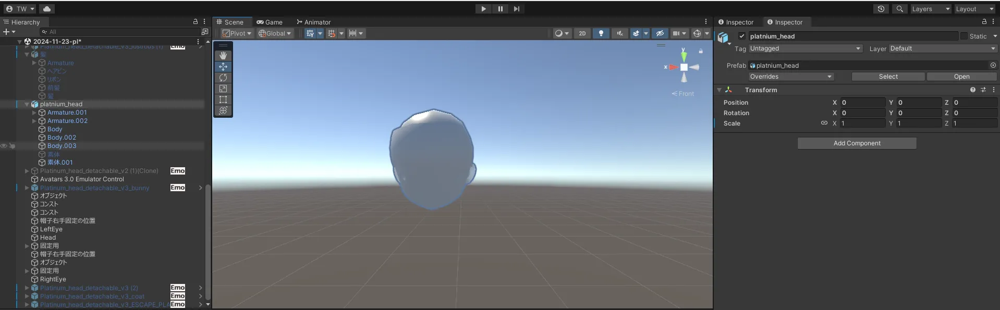

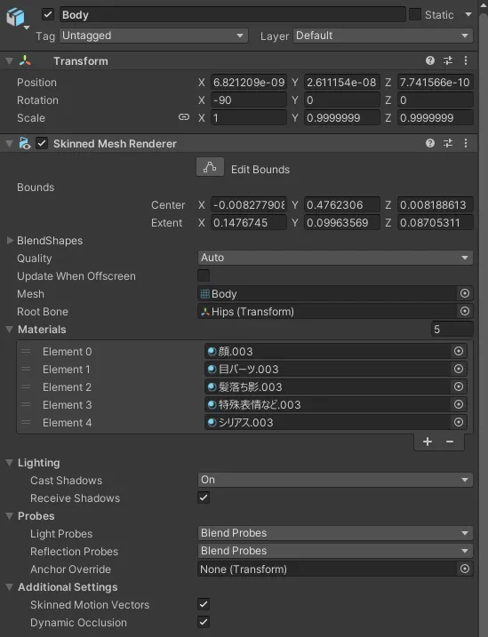  

#### 付けたい髪の毛のみのFBXファイル
デフォルトの髪の毛を使いたい場合はblenderで前髪部分と後ろ髪の部分を分割しておく。  
VRC HeadChopを使えばこの作業は不要な可能性が有る。
  
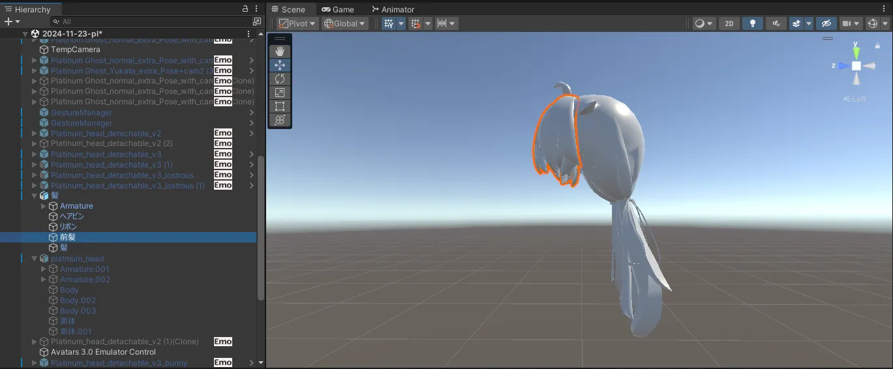  
  

#### 改変用アバターの体のみ(首より上が無い状態)のファイル

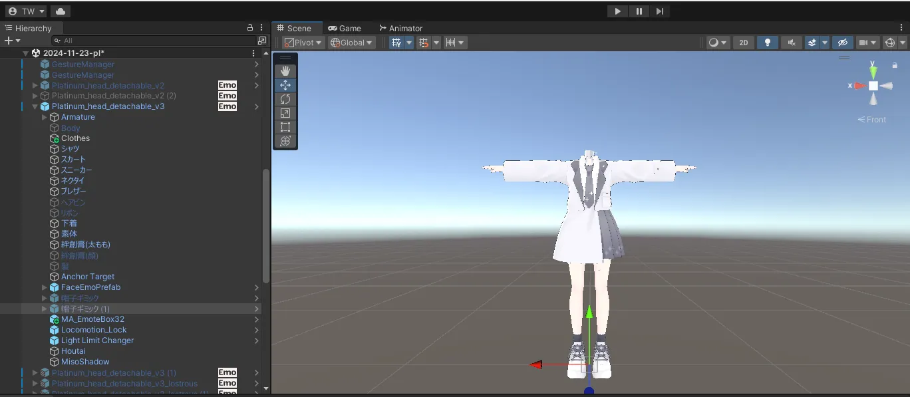  

こんな感じでBody (頭の設定などがあるメッシュレンダラー)とHairが無い状態ならOK。

#### 見栄えを良くするためのメッシュ
首の穴やズレなどを隠すために必要。  
基本的に、首を隠す用なら何でも良い。例としては、炎やアクセサリーなどが有る。  
今回は包帯をアクセサリーとして利用する。

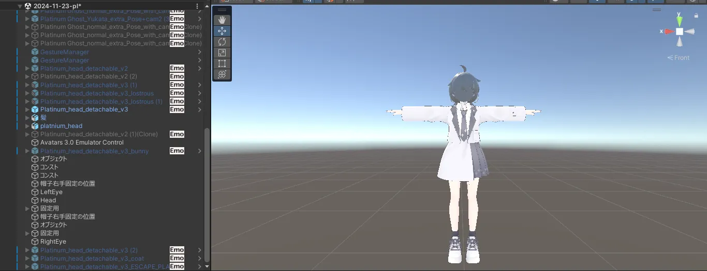  

### 必要ギミック  
[【つるギミック】帽子ギミック](https://booth.pm/ja/items/4977797)
コレをプロジェクトにインポートしておく。
### 必要ツール
- Modular Avatar
    - 帽子ギミックの必須ツール
- FaceEmo
    - 表情設定用
    - これに関しては別のツールでもOKだが、本稿ではコレを使用する
- AV3Emulator
    - デバッガーとして採用

## 前処理
BlenderでエクスポートしたFBXファイルに、使用したいアバターのマテリアルをセットしておく。
次のセクションからは、マテリアルをセットした状態で行われるものとして挿絵などを撮影している。
## 帽子ギミックを導入する
体のみのアバターに帽子ギミックのprefabを導入する。

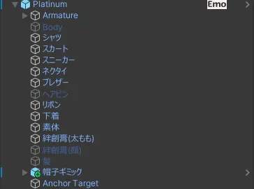  
  
次に、帽子ギミック内の"物"以下に頭のみのファイルを導入する。
前髪と後ろ髪を分割した場合はここに髪の毛のファイルも同様に導入する。  

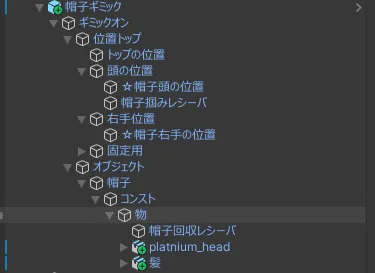  

そうすると、上の方に首が行ってしまうので、目視でPositionを合わせる。
髪の毛も同様にPositionを合わせる。
また、前髪と後ろ髪を分割した場合、**前髪のみ有効化する**。
及び、後ろ髪は無効化する。
こうしないと、VRCの仕様でPhysboneが暴れるからだ。

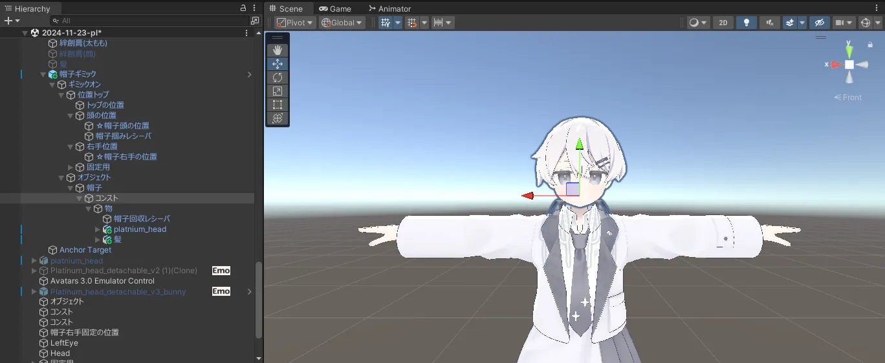

## 帽子ギミック調整
初めに、手に持つ際の場所を調整する。
帽子ギミック内の"コンスト"を選択する。  

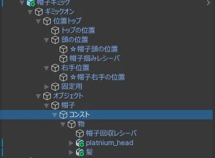  

Parent Constraint内の値を次のように設定する。
- "☆帽子右手の位置"を1に
- "☆帽子頭の位置"を0
  
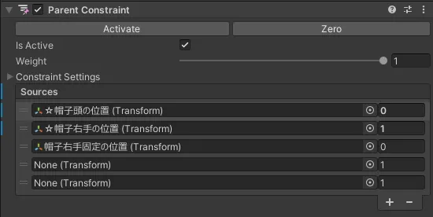  
すると、頭が右手の位置に移動する。しかしながら、殆どの場合は手の位置からずれているため調整する。

"☆帽子右手の位置"を動かすと頭も同様に動くため、頭を手のひらに合わせる。
ココに関しては、各自のプレイスタイルによって各自調整となる。次に載っている写真はあくまでも一例として見てほしい。

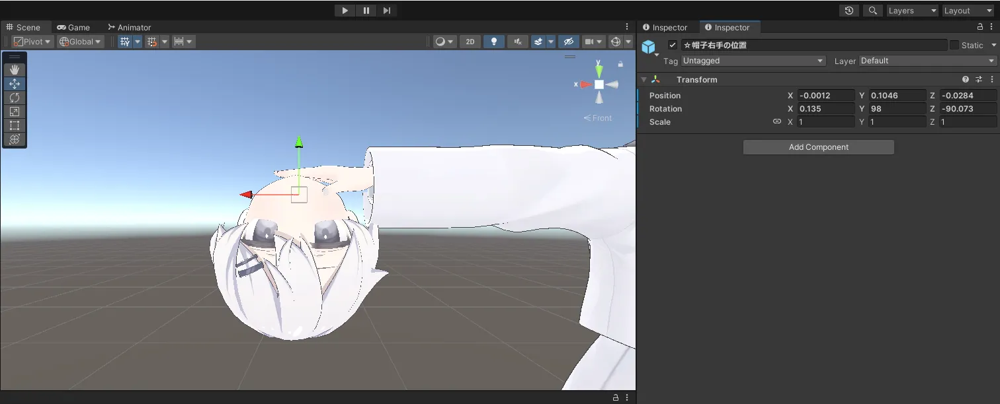  

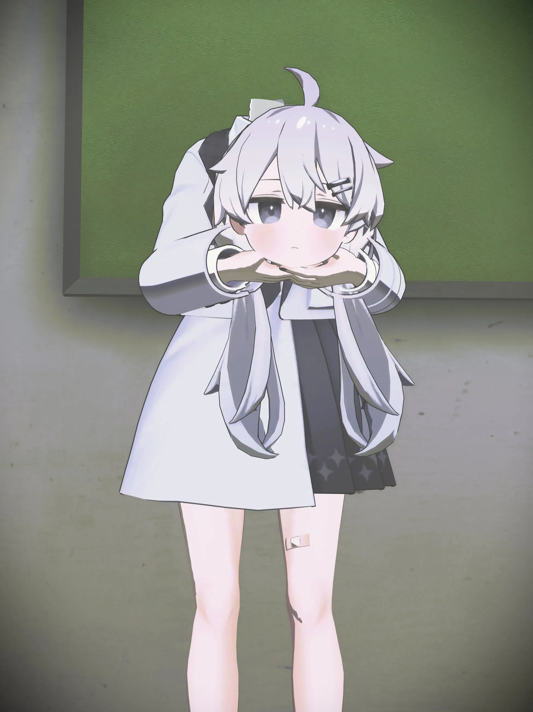  

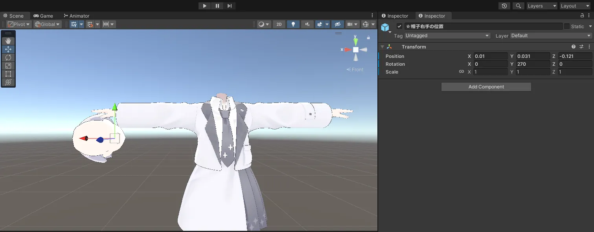  

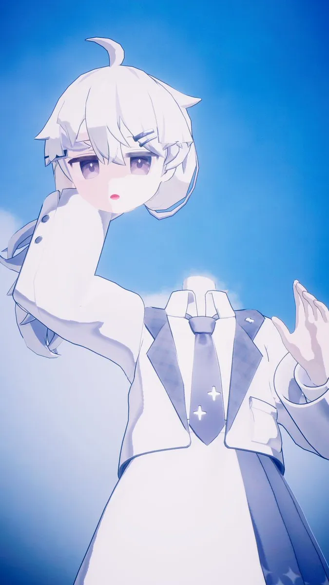  

ここら辺の値の設定は後々でも調整が可能なので、VRをつけた状態から調整しても良い。  
最終的に満足が行ったら、"コンスト"内の値を次のように設定する。
- `☆帽子右手の位置`=0
- `☆帽子頭の位置`=1

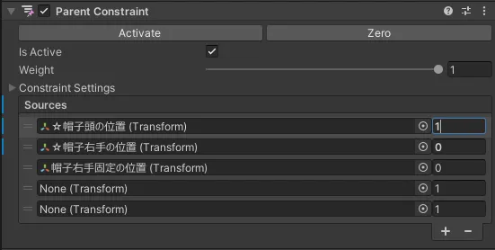  

ここまでの調整をした場合、ヒエラルキーが次のようになります。

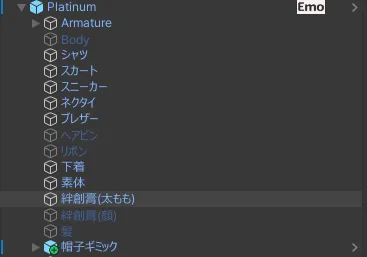  

## 髪の毛の追加
ここまで作ってきた帽子ギミックのパッケージをコピーしてアバター直下にペーストする。
帽子ギミックを選択して、Ctrl+Dキーを押せばOK。  

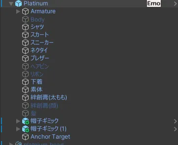  

コピーした帽子ギミック内の"物"の中に髪の毛を入れる。  
前髪と後ろ髪に分割した場合は**後ろ髪のみ**有効化する。  
頭や前髪はEditorOnlyにして非表示にしておく。

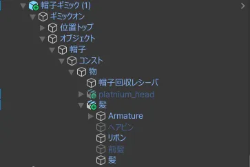  

そして、コピーした帽子ギミックの"コンスト"を選択する。
コンスト内の`Scale Constraint`コンポーネントを削除する。

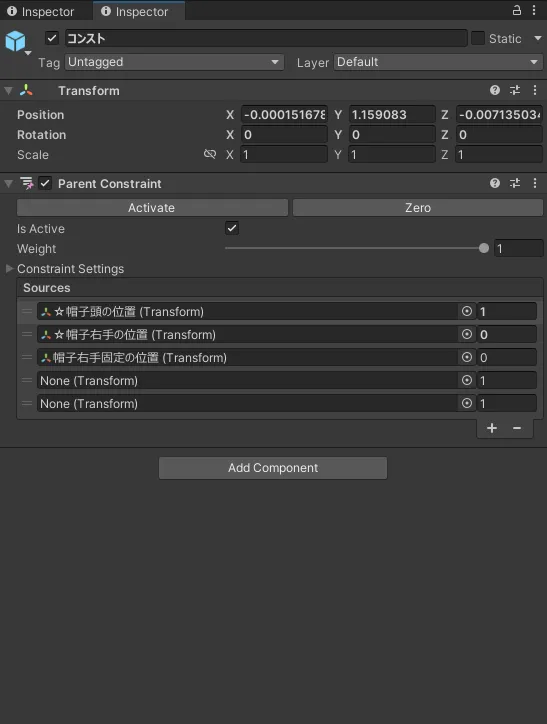  

こうすることによって髪の毛のPhysBoneが暴れなくなる。
最終的に次のようになる。

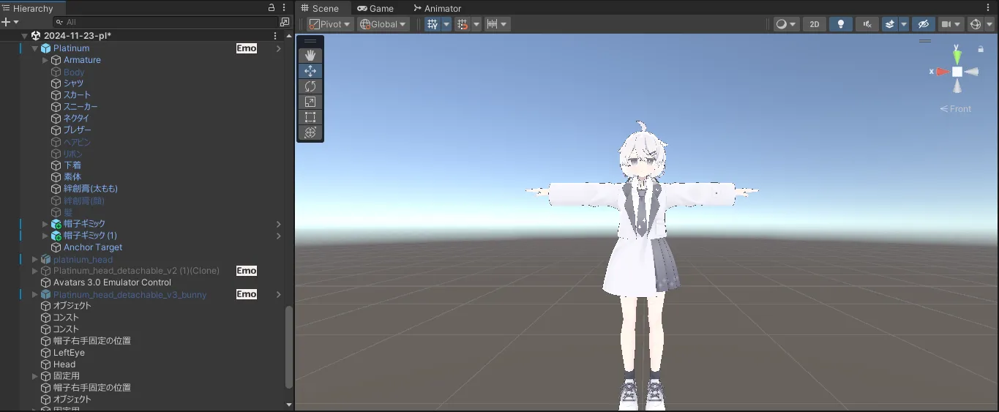

## デバッグ
これで、概ねデュラハンアバターの設定が完了した。  
ココで一度、AV3Emulatorでデバッグを行ってもらいたい。  
デバッグ中に確認してほしいことは以下になる。
- パラメータ内の、`帽子右手の値`を弄る
- ロコモーションの変更
- アバターの移動

とりあえずここが確認できればチェックポイントとなる。Ctrl+Sを押してコーヒーブレイクをしておこう。
この時点で表情が壊れていても問題は無い。次のセクションで直していく。
## VRC Avatar Discriptorの設定
このままの状態だと、目の動きや瞬きが無くなってしまうため、設定する。
まず、アバターを選択した際に表示される、VRC Avatar Discriptorの設定をする。

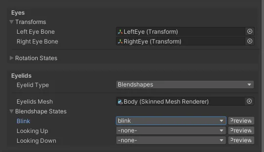  

Eyes設定のボーンを帽子ギミック内の頭のEyeボーンに変更する。
Eyelidsメッシュを帽子ギミック内のbodyメッシュに変更する。  
これでDiscriptor側の設定は完了した。
## 表情の設定
現在の状態だと、元の表情アニメーションが動作しないため、このアバター用の表情アニメーションを製作及び設定をする。  
FaceEmoを起動し、アバターの表情をゼロから作る。
基本的にはFaceEmoの操作で問題ない。  
しかし、取れる方の頭のシェイプキーを使うため、先にFaceEmoの設定をする必要がある。  
FaceEmoの操作画面の"オプション設定"を開く。  
その後、"追加表情メッシュ"に帽子ギミック側のメッシュを追加する。  
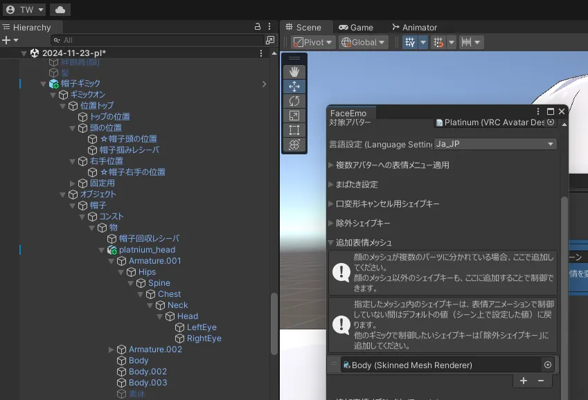  
そうすることによって、FaceEmoで表情を制作する際に、帽子ギミック内のシェイプキーが表示される。
これを利用して表情を作る。
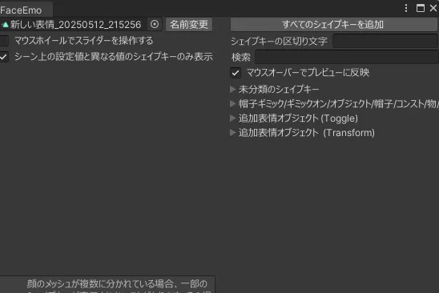  
表情の作り方などは省略する。
各自、好きな表情を制作し、割り当ててほしい。

## デバッグ
ココで、もう一度デバッグを行う。やることは先ほどのデバッグと同じで良い。
この時点で表情や顔の動きに問題が無ければ殆ど完成に近い。
とりあえず、Ctrl+Sをして保存しておこう。ココまでの作業はかなり多いからココでデータが死ぬと非常に不味い。  
日を改めている人はコーヒーブレイクでもしておこう。山場は超えた。  

## アップロードと実環境でのデバッグ
無事に、表情まで設定完了したら、このままアップロードをする。
そして、VRC上で動作確認を行う。
この際、髪の毛の一部が画面に写る場合があるが、現状では仕様となる。
無視できる場合は無視していいが、無視したくない場合は以下のセクション通りにする。
また、頭を持つ判定が気になる場合の対処法も書く。

## 髪の毛にHeadChopを適用する
HMDの画面に微妙に髪の毛が表示される場合は、VRCHeadChopという、「適用したオブジェクトを自分の視点に映さない」コンポーネントを追加する。
しかし、適用の設定が甘いと、頭を持った時に「相手側は頭が見えているけど自分からは見えない」という状況になる。
コレを回避するためにAnimetor ControlerとAnimationを書く必要がある。

先ずは、髪の毛のArmatureボーンに、VRCHeadChopコンポーネントを追加する。
そして、先ほど追加したVRCHeadChopコンポーネントを有効化、無効化をそれぞれ行うアニメーションを作る。
次に、FXレイヤーに次の図のようなアニメーションコントローラーを追加する。  
以下の図はBool値の`True`をT、`False`をFとして表す。
また、条件の`OR`と`AND`は論理演算子とする。

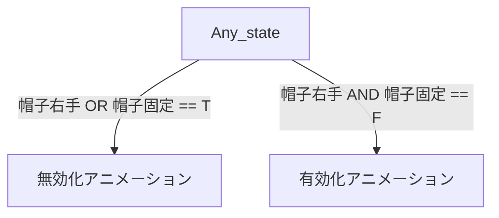
また、帽子ギミックで追加される値をパラメータに追加しておく。  
今回の場合は`帽子右手`と`帽子固定`で、どちらもBool値で定義する。
コレで、HeadChopの設定は完了だ。

## 持つときの判定を調整する
このままの判定では、VRで頭を着脱する際に頭を戻す位置及び頭を取る位置が微妙にズレている。
そこで、頭を取る位置及び戻す位置を調整する。
初めに、帽子ギミックと帽子ギミック(1)内にある`帽子掴みレシーバ`と`帽子回収レシーバ`を全て選択する。Ctrlキーを押しながらクリックすれば良い。
そして、これらをちょうど頭の位置およびサイズに合うように調整する。

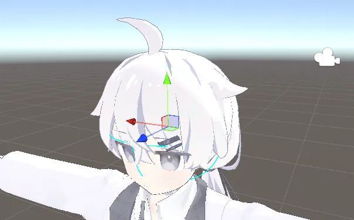

コレで持つ位置と戻す位置の調整が完了した。
## 完成
ココまででデバッグやテストを行って、問題なく首を取ることが出来れば完成となる。  
おめでとう。コレで君もデュラハンへの仲間入りだ。  
ココまで読んで実践する狂気的な人が居たら是非コメントしてほしい。Twitter(現X)のDMにでも写真を投げてもらえると非常に嬉しい。  
読んだだけでもコメントして欲しい。「○○が分かりづらい」等が有れば出来る範囲で対応する予定だ。

## 謝辞
本ページを執筆するにあたって、技術提供していただいた[あんだVRC](https://x.com/under_vrchat)氏及びに推敲協力していただいた[momonger](https://x.com/Black_Momonger)氏らに多大なる感謝を表します。
