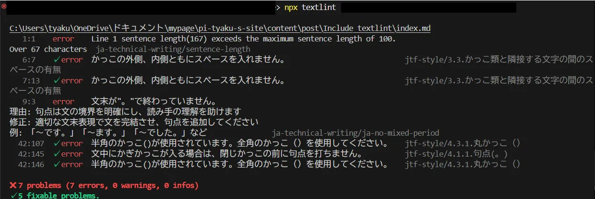
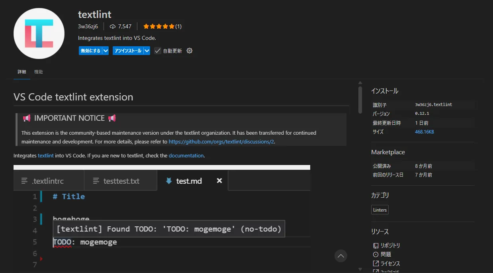
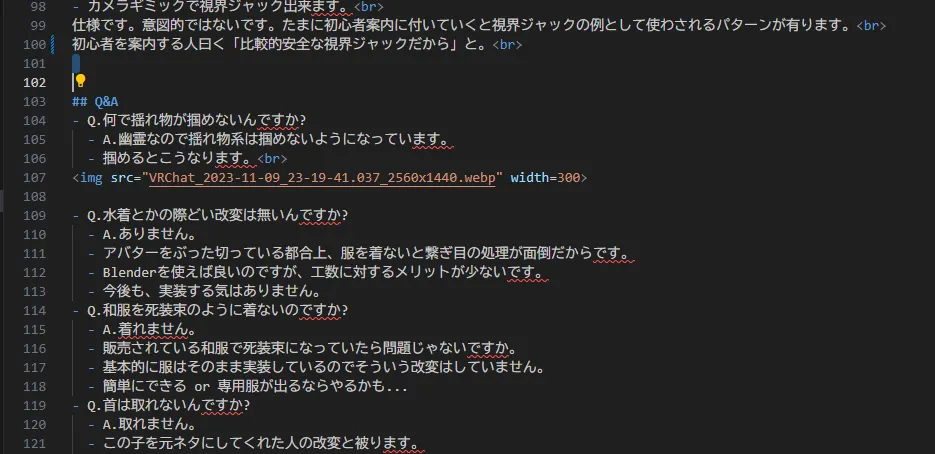

<!-- textlint-disable prh -->
+++
date = '2025-11-09T17:53:43+09:00'
draft = false
title = 'Textlintの導入方法'
slug = 'Include_textlint'
tags = ["Tech"]
categories = ["Tech"]
comments = true
+++
<!-- textlint-disable prh -->
## はじめに
こんにちは、pi-tyakuです。遂に、このWebページの開発環境にtextlintを導入しました。  
なので導入方法と環境構築の方法を纏めていきます。
## TextLintとは
  
textlintはNodejsで作られた静的解析ソフトです。  
Textlintは、markdownファイルやtxtファイルを解析し、校正ルールに沿って文章を校正してくれます。感覚的には、「自然言語のデバッガー」みたいに使えます。  

## 環境構築と本体のインストール
textlintはNodejsで作られているので、Nodejsを初めにインストールする必要があります。なので各個人でインストールを済ませて`npm`コマンドを実行可能な環境にしてください。  
初めに、プロジェクトのディレクトリに移動して、`npm`を初期化します。  
```
$ npm init --yes
```
初期化後、textlint本体をインストールします。  
```
$ npm install textlint
```
インストールが完了したら、textlintを初期化して、必要なファイルを生成します。  
```
$ npx textlint --init
```
コレでプロジェクト内に`.textlintsrc.json`が有ればOKです。  

## ルールのインストールと設定
次に、textlint用の校正ルールのインストールを行っていきます。  
技術文書向けの校正ルールが有るので、それをインストールしていきます。  
```
$ npm install --save-dev textlint-rule-preset-ja-technical-writing
```
ついでにJTF日本語標準スタイルガイド（翻訳用）に準拠しているプリセットをインストールしておきます。  
```
$ npm install --save-dev textlint-rule-preset-jtf-style
```
さて、先ほど実行したコマンドによって`.textlintsrc.json`が作成されました。このファイルはtextlintの設定を書き込むためのファイルです。このファイルに使いたい校正ルールを書き込んでいきます。(無しでもできなくはないですが、textlintが使いづらくなります)  
というわけで`.textlintsrc.json`を書き換えていきます。
```.textlintsrc.json
{
  "plugins": {},
  "filters": {},
   "rules": {
        "preset-ja-technical-writing": true,
        "preset-jtf-style": true
    }
}
```
このようにすれば先ほどインストールした校正ルールを参照するように出来ます。  
rules内を書き換えれば「一部のルールを無効」等ができるようになります。  
最後にコマンドでtextlintを使ってみましょう。  
```
$ npx textlint "filepath"
```
こんな感じにエラーメッセージ等が出ればOKです。

毎回お行儀良く文章を書いている場合は、エラーが出ない事もあります。  
そんな時はお行儀が良い文章を書いている自分自身をほめましょう。
エラーメッセージが出ない場合は、このコマンドを実行してください。
```
$ npx textlint -v
```
コレでtextlintのバージョンが表示されていればOKです。

## VSCode対応
さて、Markdownを書いている皆さんは、殆どの場合VSCodeで書いていますよね? ここで"No"と答えた人はコマンドラインでtextlintを使ってください。   
今回はtextlintをVSCode上で動作させて、コーディング感覚で文章を書ける用にします。 
というわけでVSCodeの拡張機能をインストールします。
VSCodeの拡張機能欄に"textlint"と入力して出てきた、textlint拡張機能をインストールします。

インストール後、VSCodeの設定画面に移動し、設定の検索欄に"textlint"と入力してtextlint拡張機能の設定を探します。
`textlint config Path`欄が有るので、先ほど作った`.textlintsrc.json`のパスを入力します。  
コレによって、VSCodeでtextlintを利用する準備が完了しました。一応VSCodeを再起動してください。  
プロジェクト内の適当なmarkdownファイルでもtxtファイルでも開いて見てください。
  
文章ファイルがプログラミング中、あんまり見たくない画面になっていれば成功です。
なってなかったら適当に変な文章(例:同じ助詞を何度も使った文、"だ、である調"と"ですます調"が混ざった文など)を入力して、保存してみてください。赤い波線が付きます。
この部分がtextlintで挙げられているエラーメッセージです。他のプログラミング言語のようにエラーの部分がハイライトされます。  
あくまでも、textlintで挙げられているエラーは、致命的な文法ミスから文章表現の1つまでも内包している事を忘れてはいけません。  
文章制作はコーディングとは違うので、これらのエラーメッセージを無視可能です。 
まぁ殆どの場合は、無視しないで推敲した方が良い文章になりますが。
## Hugoでの使い方
今までの内容でVScode上で**通常のmarkdown,txtファイル**の構文チェックが出来るようになりました。  
しかしながら、hugoのmarkdownにはヘッダーがあります。
```header.md
+++
date = '{{ .Date }}'
draft = true
title = ''
slug = '{{ replace .File.ContentBaseName "-" " " | title }}'
tags = \[]
categories = \[]
comments = true
+++
```
このヘッダーがtextlintでエラーを吐かせる原因になっています。構文エラーではないですし。  
このエラーを無視するのも1つの手ですが、どうせならtextlinkの機能を利用し、エラーメッセージを無視しましょう。
初めに、textlintにコメントアウトを実装するパッケージをインストールします。
```
$ npm install textlint-filter-rule-comments 
```  
パッケージをインストールした後、`textlintsrc`に「パッケージを有効化する」記述をします。
注意点として、このパッケージは、filterなので`textlintsrc`のfilter内に記述する必要があります。
```textlintsrc.json
{
  "plugins": {},
  "filters": {
    "textlint-filter-rule-comments ": true
  },
   "rules": {
        "preset-ja-technical-writing": true,
        "preset-jtf-style": true
    }
}
```
とりあえずコレでフィルターパッケージを導入、有効化が出来ました。  
エラーを無視するためには、こんな文章を本文内に追加すれば良くなります。
```
<!-- textlint-disable prh -->
<!-- textlint-disable prh -->
```
この文章に囲まれた部分がエラーを無視する範囲になります。さながらC言語の/**/みたいな感じです。
先ほどのヘッダーをこいつで囲えば、ヘッダー部分でエラーが出なくなります。
ついでに、Hugoで新しいページを作った際に、ヘッダーがコメントアウトされているようにプリセットを変えてしまいましょう。
何事も手を動かす回数は減らしたいものなので。  
Hugoプロジェクト内のarchetypes内のdefault.mdを書き換えます。
```default.md
<!-- textlint-disable prh -->

+++
date = '{{ .Date }}'
draft = true
title = ''
slug = '{{ replace .File.ContentBaseName "-" " " | title }}'
tags = \[]
categories = \[]
comments = true
+++

<!-- textlint-disable prh -->

```
こうすればHugoのページ追加をした際に、コメントアウトが自動で挿入されるようになります。

## まとめ
今回は自然言語校正ツールのtextlintの導入方法をまとめました。  
textlintを導入した環境で文章を書くと、コーディングをしていないのにエラー取りを行っている気分になるのでお勧めです。  
ぜひプログラミングをした事がない人も、した事がある人もtextlintを導入して文字を書きましょう。
pi-tyakuでした。
## 参考サイト
[文章校正を行うためのtextlint入門](https://ics.media/entry/220404/)  
[textlint と VS Code で始める文章校正](https://qiita.com/takasp/items/22f7f72b691fda30aea2)  
[textlint official logo](https://github.com/textlint/media)  