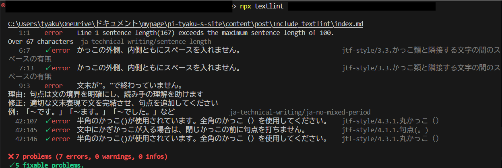

+++
date = '2025-11-09T17:53:43+09:00'
draft = true
title = 'Textlintの導入方法'
slug = 'Include_textlint'
tags = ["Tech"]
categories = ["Tech"]
comments = true
+++
## はじめに
こんにちは、pi-tyakuです。遂に、このWebページの開発環境にtextlintを導入しました。  
なので導入方法と環境構築の方法を纏めていきます。
## TextLintとは
textlintはNodejsで作られた静的解析ソフトです。Textlintは、markdownファイルやtxtファイルを解析し、校正ルールに沿って文章を校正してくれます。感覚的には、「自然言語のデバッガー」みたいに使えます。  

## 環境構築と本体のインストール
textlintはNodejsで作られているので、Nodejsを初めにインストールする必要があります。なので各個人でインストールを済ませて`npm`コマンドを実行可能な環境にしてください。  
初めに、プロジェクトのディレクトリに移動して、`npm`を初期化します。  
```
$ npm init --yes
```
初期化後、textlint本体をインストールします。  
```
$ npm install textlint
```
インストールが完了したら、textlintを初期化して、必要なファイルを生成します。  
```
$ npx textlint --init
```
コレでプロジェクト内に`.textlintsrc.json`が有ればOKです。  

## ルールのインストールと設定
次に、textlint用の校正ルールのインストールを行っていきます。  
技術文書向けの校正ルールが有るので、それをインストールしていきます。  
```
$ npm install --save-dev textlint-rule-preset-ja-technical-writing
```
ついでにJTF日本語標準スタイルガイド（翻訳用）に準拠しているプリセットをインストールしておきます。  
```
$ npm install --save-dev textlint-rule-preset-jtf-style
```
さて、先ほど実行したコマンドによって`.textlintsrc.json`が作成されました。このファイルはtextlintの設定を書き込むためのファイルです。このファイルに使いたい校正ルールを書き込んでいきます。(無しでもできなくはないですが、VSCodeを利用する際に使いづらくなります。)  
というわけで`.textlintsrc.json`を書き換えていきます。
```.textlintsrc.json
{
  "plugins": {},
  "filters": {},
   "rules": {
        "preset-ja-technical-writing": true,
        "preset-jtf-style": true
    }
}
```
このようにすれば先ほどインストールした校正ルールを参照するように出来ます。  
rules内を書き換えれば「一部のルールを無効」等ができるようになります。  
最後にコマンドでtextlintを使ってみましょう。  
```
$ npx textlint "filepath"
```
こんな感じにエラーメッセージ等が出ればOKです。

## VSCode対応