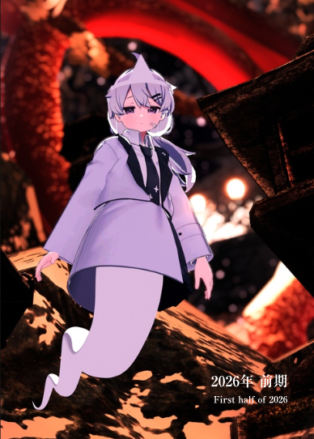

+++
date = '2026-06-28T13:33:26+09:00'
draft = false
title = '2026年前期のフォトブックを作った話'
slug = 'Made_First_half_of_2026_photobook'
tags = ["雑記","photo","photobook"]
categories = ["雑記","photo","photobook"]
image = ''
comments = true
+++
## はじめに
こんにちは、pi-tyakuです。クソ忙しい時期が終わり、またもやこの時期がやってきました。そう、フォトブックを作る時期です。  
というわけで2026年前期のフォトブックを作ったので、軽く紹介していきます。
## 表紙
  
## ページ数
**全面フルカラー96P!**  
**24pも増量!!**
## 写真数
**229枚!**  
**フォトブック限定の写真も有り!!**
## 文字数
**約2000文字程度!!**  
**フォトブックとは?!?!?!**
## 使用印刷所
**しまうまプリント**
## 総評
**なぜ前回よりもボリュームを増やしたのか!?**  
**本当に無駄に豪華!!!!!!!!!!!!!!!!!!!!!!**
## 感想
今回も何故かある感想コーナーです。  
前回に比べて、色々と「アップデート?」「アップグレード?」された部分が多くなりました。  
まずはページ数、これはわかりやすいアップグレードですね。24ページも増えて最終的に96ページになりました。本当は72p予定で書いていたんですが、普通にページが足りなくなりました。  
なので、文字による紹介を4p入れたり、見開きを使ったページもあります。それでも4～5ページ位余りましたが。そこには「現時点で公開されていない写真(多分Xに上がる)」や「フォトブック限定の写真(SNS上に公開しない)」を入れました。限定という言葉はいいですね、本当に。  
次に、文字数ですかね。これも明確なアップグレードです。前回は、文字＋写真のページはほとんどありませんでした。今回は、「フレーバーテキスト＋写真」と「説明＋写真」という文字も写真、両方楽しめるページを追加しました。楽しめるような文章を書けているのかが心配ですが。  
最後に構成です。地味ですが気になっていたアップデート点です。今回は、16:4,4:3,5:7の写真ごとに、一律した縮小比率を設定して配置を決定しました。「16:4なら87%の大きさ」にするとか、「3:4だと63%」だとかを設定して配置しました。また、1ページごとに「カラー系統が同じ」かつ「同じ比率」の写真を詰め込んでいます。こうすれば、綺麗に配置できるので。  
というわけで感想ページでした。どんどんフォトブックが良くなっていくといいですね。