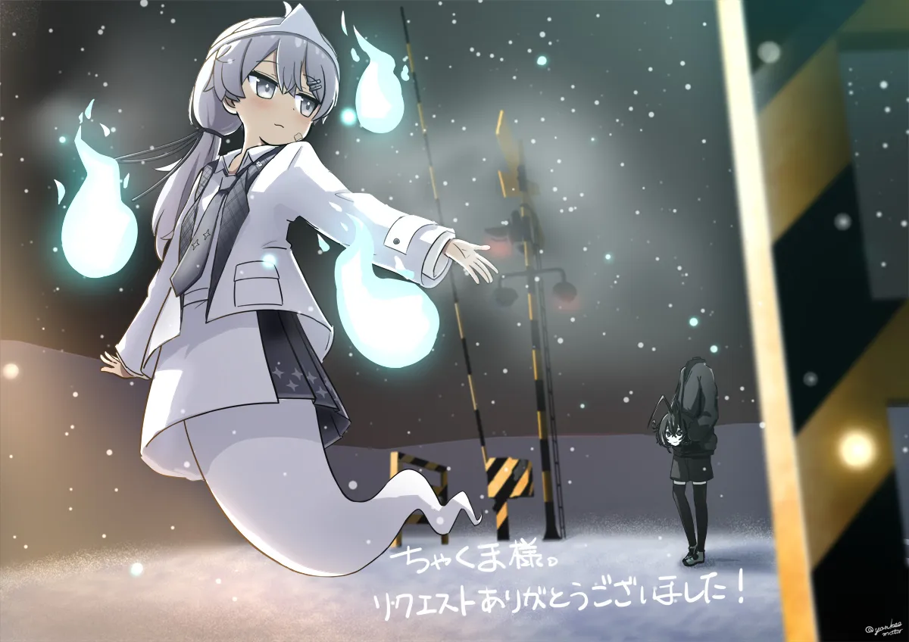
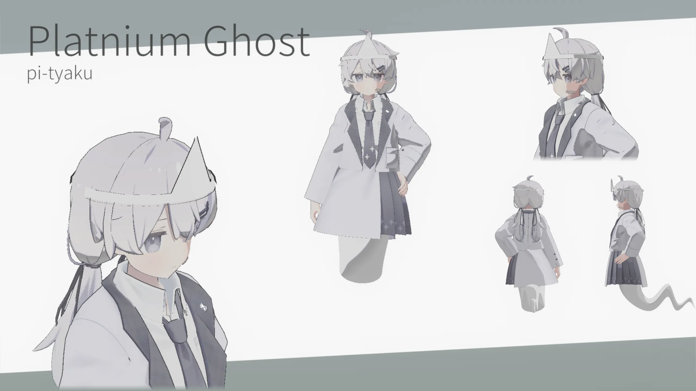

+++
date = '2026-01-28T19:13:53+09:00'
draft = true
title = '自分のアバターのグッズを作った話'
slug = 'Made_own_goods'
tags = ["雑記","Tech"]
categories = ["雑記","Tech"]
image = ''
comments = true
+++
## 初めに
皆さん、初めましての人は初めまして。そうでもない方はどうも、pi-tyakuです。最近はかなり寒くなってきましたね。  
今回は特別に、[いつもの場所](https://pi-tyaku.com)とは違う所で記事を書いています。
今回は自分のアバターのグッズを製作したので、その手順や結果を纏めます。

## 製作理由
私ことpi-tyakuは、VRChat上でよく写真を撮っています。大体1日当たり3枚程度のペースで上げていますね。

そんな生活を続けて2年が経ちました。  
その中で、私は「何か、形に残って身につけやすい物を作りたいな」と思ったのです。
そこで、自分のアバターを用いたアクリルキーホルダーを作ろうと決めました。コレが私にとって、ちょうどいい選択肢だったのです。

## 手順
次に、グッズ製作の手順を紹介します。
今回、私が行った手順は以下のようになりました。
1. アクリルキーホルダーにしたい絵を依頼する。
2. アバターや使用したアクセサリー?の規約を確認する。
3. 絵の作者の許可を取る。
4. アバターや使用したアクセサリーの作者の許可を取る。
5. グッズ制作会社でグッズを作る。
6. 完成。
という風になりました。
## 絵の依頼
初めに絵の依頼に関する部分を解説します。  
今回はpixiv Requestsで書いていただいた絵を利用しました。

ここで注意点ですが、基本的にSkebやPixiv Requestsを用いて書いてもらった絵をグッズを作る際に利用出来ません。
今回はたまたま許可が取れたので利用しました。  
「この記事を読んで、グッズを作りたくなった人」が絵を依頼する際は、次の方法を使いましょう。
- 絵師様に直接依頼する。
- グッズ制作や商用利用がOKなコースのあるコミッションプラットフォーム(Skimaなど)を利用する。
- 依頼本文に**グッズ制作をしたい旨**を入れて、コミッションプラットフォーム(Skebなど)を利用する。
今回のパターンは、**よっぽど**絵師様と仲が良いとかではないと起きないパターンです。  
「このSkebの絵が良いからグッズにしたろ！」といったことは辞めましょう。**初めからグッズにする予定**で依頼しましょう。

## 許可取り
### 一般的な場合
次に、許可の取得について説明します。  
基本的に、グッズを作る際に必要な許可は次のものがあります。  
- アバター作成者
- 服の作成者
- アクセサリーの作成者
- 絵の作成者(グッズ利用の目的外でのコミッション及びファンアートの場合)
但し、「アバター及び服、アクセサリーの作成者の許可」に関しては、VN3ライセンスの6.Q「有体物(グッズ）への利用)」(以降、有体物への利用と表記)が**許可**の場合は必要がありません。  
もちろんですが、有体物への利用が**不可**であればグッズ制作は諦めてください。    
また、VN3ライセンスが存在しない場合や、有体物への利用が「権利者に問い合わせてください」となっている場合は、許可を取る必要があります。
### 今回の場合
今回、グッズ制作をするアバターは、次のようになっています。  

構成要素として、アバターが有坂みと先生のプラチナ(有体物への利用が"権利者に問い合わせてください")、使用したアクセサリーがShaguna先生のおばけセット(VN3ライセンス無し)となっています。それに加えて、絵を描いていただいたヤンキモ先生にも、絵の使用について許可を取る必要がありました。
というわけで、ゆーてるさんにも手伝ってもらい、許可が必要な人たちに許可を貰いに行きました。ありがたいことに、全員から快くOKをいただけました。
コレで次のステップに移行します。

## 実際に作る
ココからはPixivFactryやAcceaなどの業者とのやり取りになります。
今回私は、PixivFactryを使いました。理由はAdobe製品無しで作れそうだったので。  
実際に作る上で気にするべき点としては、アクリルキーホルダーの"重心"を意識して穴の位置を決めると良いです。
穴の位置と重心が一直線になると、吊るしたときに回転しにくく、見せたい向きを保てます。
重心の割り出しには[ココ](https://ackeytools.net/)を使いました。

## 結果
というわけで、製作した結果が次のようになりました。

とてもいいですね！

## まとめ
というわけで、私自身がアクリルキーホルダーを作った話を延々としました。  
時間もタスクも、そして記事もかなり長くなりましたが、長さに対する報酬として、私にとっては最高に良いものを作れたと思います。  
この記事が、自分のアバターを使ったグッズを制作してみたい人の背中を押すきっかけになれば嬉しいです。
また、私自身のサイト(https://pi-tyaku.com)もぜひ見てください。だいたいこんな感じの話が結構あります。
それでは、またどこかで。