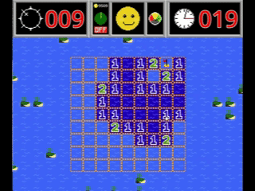
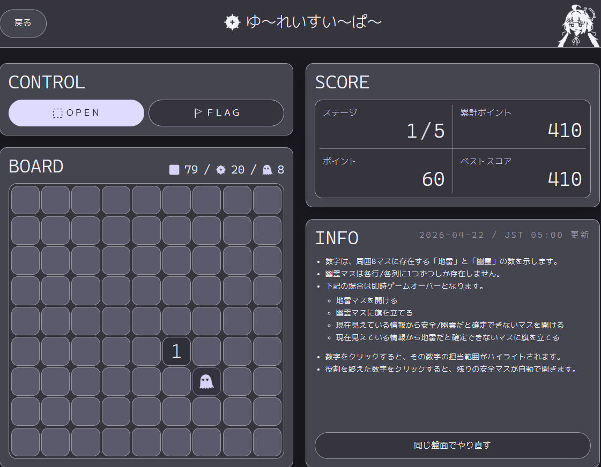

+++
date = '2026-04-21T21:16:08+09:00'
draft = false
title = 'マインスイーパーの話'
slug = 'New_type_minesweepers'
tags = ["雑記"]
categories = ["雑記"]
image = ''
comments = true
+++
## 初めに
どうも、pi-tyakuです。年度が終わり、春の季節も終わりを迎えてきている季節になりました。春、短い。  
今回は、最近ハマっているマインスイーパーの話をします。

## なぜ急にマインスイーパー?
WindowsXPなどにデフォルト搭載されているかの有名なマインスイーパー。皆さんも小さい頃は意味も分からず適当に開けて地雷を踏んでいたと思います。  
私が、かなり有名かつオールドなパズルゲームに急にハマったのは何故でしょうか?  
理由は単純です。このオールドなパズルゲームにいろいろな要素を＋して新たなゲーム性を生み出した2つのゲームが私を引き込みました。
その2つのゲームとは、**MinesweeperPlus**と**ゆ～れいすい～ぱ～**です。

## Minesweeper Plus

### Minesweeper Plusとは?
>Minesweeper Plus is classic Minesweeper.  
>PLUS:  
>1 A health gauge  
>2 A mine sonar  
>3 The ability to switch between modern and classic gameplay  
>4 The mines actually explode  
>5 A short adventure mode (with 2 episodes so far)  
>6 Neat pixel graphics  
>7 Good music  
>8 This guy has a cool hat   
>9 ???  
>10 ??????????  
>[DLページ](https://jorel-simpson.itch.io/minesweeper-plus)より引用  

[Minesweeper Plus](https://jorel-simpson.itch.io/minesweeper-plus)はクラシックなマインスイーパーに様々な要素を追加したゲームです。
Jorel Simpson氏が包括的に開発しています。
DLページは[ココ](https://jorel-simpson.itch.io/minesweeper-plus)から。
### 何故Plusなのか?
Minesweeper Plusは通常のマインスイーパーに次の物を追加しています。
- 体力ゲージ
- ソナー
- アドベンチャーモード
- ボス戦
それ以外は基本的に普通のマインスイーパーです。タブン。
### 追加要素の解説
#### 体力ゲージとソナー
  

通常のマインスイーパーは、地雷を踏んだら即終了となるゲームです。  
しかし、Minesweeper Plusでは体力ゲージが追加されたため、機雷を踏んでも即終了ではなくなっています。基本的に、3回機雷を踏むと体力ゲージが尽きてゲームオーバーになります。
  
まぁ機雷を踏むと、心臓に悪い音を鳴らしながら爆発し、真ん中の船長が痛そうな顔をするのでアレですが...  
コレが初心者には非常に優しい機能となっています。ただでさえマインスイーパーは、運が悪いと理論では詰められない部分が存在するので、そこで理不尽な死を遂げる必要が無くなるので。
更に、マインコインというリソースを消費してソナーを使うことが出来ます。機能としてはクリックした場所が必ず安全に開けられるというものになっています。  
「地雷なら勝手に旗を立てる」、はたまた「地雷ではない場合はそのまま開く」という訳です。コレでかなり理不尽な死を遂げることが少なくなります。
がしかし、「1ゲーム中の使用回数が多いほどリソースを多く消費する」という仕様があるのと、「マインコインは衣装開放やアドベンチャーモードの復活で使用する」という仕様のため、使いすぎると困る場面が多くなります。  
「ライフで受けるか?」はたまた「ソナーを使うか?」を考えながらプレイする楽しさが増えています。
コレは余談ですが、これらの要素を完全排除したマスターモードもあります。1ミスの重さを感じたい人に是非。
#### アドベンチャーモード
本作品の一番面白い部分です。
どんどん難しくなっていく盤面をクリアしていく面クリア型のゲームモードとなっています。  
ストーリーは殆どありません。何かありそうですが、文章などで語られる部分は全くありません。~~何故か面終盤になると船長がやつれていきますが...~~  
レベル1からレベル9までをクリアするエピソード1、レベル1からレベル10 or レベル11をクリアするエピソード2の2種類のエピソードがあります。
エピソード1ではレベル9がボス、エピソード2ではレベル9から11までがボス戦となっています。  
~~ちなみにボス戦だと船長がボコボコにされてからスタートします。~~  
ボス戦では基本的に、「体力ゲージ」、「ソナー」が無効化されます。ただそれでも一撃死という訳ではないのが面白い所。  
また、エピソードごとにBeginner,Novice,Veteran,Expertの4段階の難易度が設定されています。とりあえずBiginnerからやればOKです。一部隠し要素を公開したいならNoviceをやりましょう。かなり難しいですが。  
「HPが0になる」、「ボスに敗北する」とゲームオーバーになります。コンティニューには、ソナーなどで使われるマインコインを消費する必要があります。  
通常ステージに比べてボス戦でのコンティニューコストが低く設定されています。  
~~これでいくらでもボスにボコボコにされることが出来ますね!~~  
ぶっちゃけるとエピソード1より2のほうが圧倒的に難しいです。  
ボスの9と10も問題ですがエピソード異常な形の盤面が沢山出てきます。ほぼ長方形のステージは出てこない。
コレが厄介なこと極まれる。ただでさえ判別が難しいマス目の数が変になるので。

#### ボス戦(9)

##### ボスの概要
すべてのエピソードに出てくるボスです。マインスイーパーでは存在しない数である**9**を背負って登場です。
このボスは盤面を動き回り、プレイヤーが建てた旗を破壊、更には設置されていた機雷を移動させてきます。  
また、このボス戦は時間制であり、時間が切れるまでに全ての安全なマスを開いてボスである9自身をクリックすると勝利となります。
「時間が0になる」、「安全なマスが残った状態で9をクリックする」とゲームオーバーとなります。
また、機雷を踏むと時間経過の速度がどんどん加速していきます。基本的に機雷を踏まないようにしましょう。  
##### 感想
「機雷自身が動く」というマインスイーパーでは有り得ない状況に反して以外に素直なボスです。  
「落ち着いて確実に安全なマスを開く」コレを意識すればぶっちゃけ負けません。但し、焦って全ての安全なマスを開いていない状態で終わろうとすると**死が確定する**ので精神的に落ち着けなくなるというジレンマを突きつけるボスです。
まぁ面白い。焦ると死ぬし、のろまでも死ぬ。マインスイーパーのタイムアタック性を高めるボスで非常に良いですね。
#### ボス戦(10)

##### ボスの概要
エピソード2に出てくるボスです。マインスイーパーに存在不可能な**10**を背負って登場です。  
このボスは**盤面を無視**しながら動き回ります。  
ボスは10カウントをし、「カウントが0になる」前にボス自身をクリックする必要が有ります。クリックできるとボスのカウントが10に戻ります。  
このボスは時間制ではなく、盤面内の安全なマスを全て開けることによってクリアとなります。  
機雷を踏むとボスのカウントがどんどん早まっていきます。また、ボス自身をクリックすることによってもボスのカウントと移動速度が早まっていきます。  
ボスのカウントが0になるとゲームオーバーです。
##### 感想
盤面は素直なのにエイム力が要求される癖の強いボスです。  
ぶっちゃけ滅茶苦茶強い。カウントが迫ると音がなるので盤面に集中できないのと、時間を掛けるとボスの移動速度が早くなるので非常に集中力が途切れます。   
「とにかく急いでマスを開ける」という9とは全く逆の性質のボスです。
滅茶苦茶苦労しました。
#### ボス戦(9&10)
終わり。絶望。  
正確に10をクリックしながら9を攻略する必要があります。ヤバすぎる。  
Beginner難易度では出てきません。安心ですね。
### 良い点
マインスイーパーの遊びづらかった点を綺麗に無くし、加えてリトライ性の高い面白い遊びを追加した作品です。  
初心者救済としての機能と上級者向けのボス戦が綺麗に同居していると思います。低難易度ならボスもそこまで殺意が高くない?ので。
ストーリー一周の速度が早く、リプレイ性が高いです。これによって自分自身のマインスイーパースキルの向上が分かりやすいです。  
曲が尋常じゃない位良いです。SNKのゲームのような感じの音楽がとても良いですね。
### 悪い点
日本語対応していません。悲しい。
アドベンチャーモードの一部テンポが悪いです。もっと早く舟を移動させてほしい。
アドベンチャーモードのストーリーが無いに等しいです。文字で説明されないのはまぁ良いのですが。ローカライズされていないので。でも後半のステージでは船長の人相が異常に悪くなるのは本当になんででしょうか?死線をくぐり抜けているからなのかしら?  
ビッグモードが死にモードです。クソでかいステージでマインスイーパーをやるだけです。ただ時間が掛かるだけ。
### 総評
Windows付属のマインスイーパーで挫折した人にぜひプレイしてもらいたい。マインスイーパーの本当の面白さを知れます。  
面白いアーケードゲームみたいな感じです。リトライコストも低く初心者にも優しいですし。  
逆に難易度を上げたりマスターモードを使うことによって、マインスイーパー上級者でも楽しめると思います。
ボス戦の絶望感も良いです。ボス戦では船長も叩きのめされるので、覚悟がキマります。  
本当に面白いゲームでした。

## ゆ～れいすい～ぱ～

### ゆ～れいすい～ぱ～って?
[しぃあ](https://x.com/shia_aizawa)氏が開発したマインスイーパーです。  
プレイは[ココ](https://shiag.host/games/sweeper)から。
### ルール
>## 特殊ルールありのパズル感強めなマインスイーパー！
>数字は、周囲8マスに存在する「地雷」と「幽霊」の数を示します。  
>幽霊マスは各行/各列に1つずつしか存在しません。  
>下記の場合は即時ゲームオーバーとなります。
>- 地雷マスを開ける
>- 幽霊マスに旗を立てる
>- 現在見えている情報から安全/幽霊だと確定できないマスを開ける
>- 現在見えている情報から地雷だと確定できないマスに旗を立てる
>数字をクリックすると、その数字の担当範囲がハイライトされます。  
>役割を終えた数字をクリックすると、残りの安全マスが自動で開きます。  
>[https://shiag.host/games/sweeper](https://shiag.host/games/sweeper)より
### 総評
論理で全てのマスを詰める必要があるマインスイーパーです。
コレがまぁ非常に難しい。まだ一回も盤面をクリアしたことが無いです。  
まだランダム性が有るMinesweeper Plusの方が優しい、と思ったけどボスが居るのでトントン位ですね。  
幽霊の存在によって詰められる所も有れば、数字に惹かれて幽霊に旗を刺す事も有る...そんなゲームです。  
日によってステージが変わっていくのと、ランキング機能があるのでWoodleみたいに楽しめると思います。  

### 終わりに
という訳で2つのマインスイーパーを紹介しました。  
この2つともかなり面白いゲームとなっているので是非とも遊んでみて下さい。