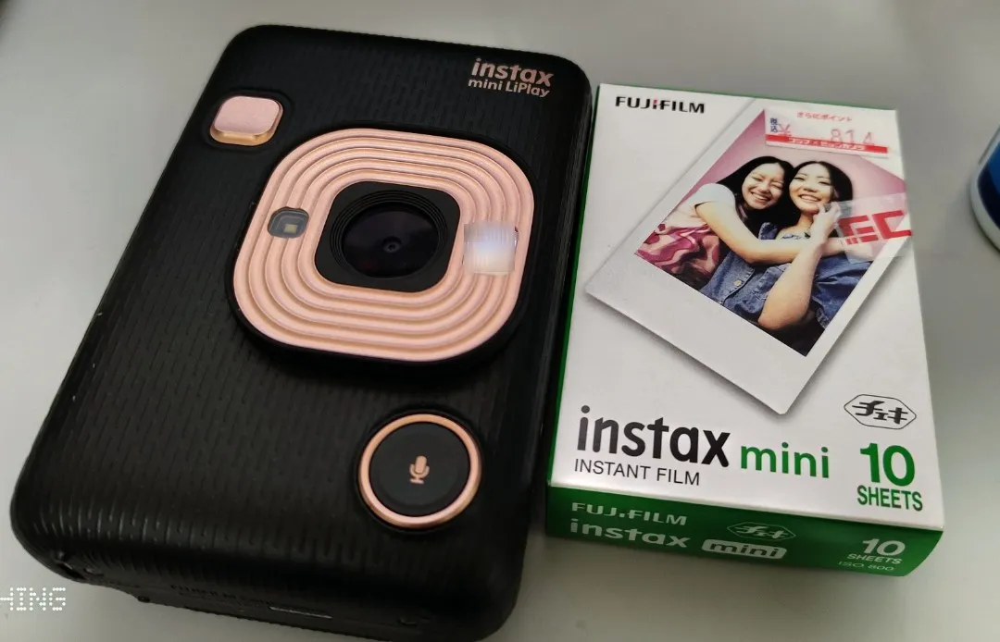

+++
date = '2025-12-01T13:04:25+09:00'
draft = false
title = '11月のまとめ'
slug = 'September_summary'
tags = ["雑記"]
categories = ["雑記"]
comments = true
+++
## 初めに
こんにちは、pi-tyakuです。毎回寒さや時候の挨拶を延々としていたら、冬になっていました。  
**秋どこ行った?** しょうがないので冬服を出して夏服をしまい、冬支度を進めました。
気がついたら11月が終わっていたので簡単なまとめ等を書いていこうと思います。  
~~「10月のまとめは?」とか言うなよ。忙しかったせいで書く余裕がなかったんだよ。~~

## Textlint
  
細かいことは[ココ](/content/post/Include_textlint/index.md)を参照。
今月の技術系解説記事です。多分貴重な今月出せるタイプの進捗です。概ね10,11月は出せない進捗が一杯有るので...  
ともかく普通に使いやすいソフトですねコレ。誤字脱字チェックや言い回しの修正がやりやすくなります。

## Instax Mini Liplay
  
細かいことは[ココ](/content/post/Buy_instax_liplay/index.md)を参照。  
地味に初めてのデジタルカメラなのと2台目のインスタントカメラだったりします。  
個人的に気軽に撮影できるデジタルの存在はありがたいところが有りますわ...  
撮影した写真がたまり次第[Photo](/content/photo/_index.md)に上げておきます。

## HHKB Hybrid Type-s
地味にしれっと交換していたガジェットです。前までHHKB Classicを使っていたので。
HHKB Classicに関しては[ココ](https://note.com/pi_tyaku8788/n/nfe1b058ddf81)を参考に...地味にあのキーボードも改造していましたねぇ...    
勿論前回のHHKB Classicと同じカラーの墨、さらに無刻印仕様を使っています。
ちなみに今回のHHKBも全て分解して可動部にシリコンオイルの塗布や背面のゴム板の設置などの改造を施しておきました。HHKBをバラすのは3回目くらいなので流石に慣れましたわ。    
感想としては、地味に気になっていたケーブル周りがスッキリして使いやすいですわねコレ。
静穏性に関しては改造前だと改造済みHHKB Classicよりもうるさく、改造後で大体改造済みHHKB Classicと同じくらいの静さになったと思います。  
まぁ興味のある人と保証なしのHHKBを持っている人が居るなら改造方法を教えますよ。  
~~そんな人居ないと思うけど...~~

## 「分かった！」と思わせる説明の技術 知識ゼロの相手にも伝わるようになる本
地味に気になっていた本です。やっと読むことが出来た...  
[「分かりそう」で「分からない」でも「分かった」気になれるIT用語辞典](https://wa3.i-3-i.info/index.html)というITエンジニアなら一度は開いたことがあると思われる有名かつとんでもなく分かりやすいIT用語辞典の管理人が書いている本です。Webサイトの方も普通に分かりやすくて面白いので是非。  
内容の概要としては、「人に説明する技術」を解説する本となっています。やはりあのサイトを書いている人が執筆しているので内容が分かりやすい...
個人的には、「説明をする際におもてなしの心を持つ」という部分が概念として面白いと思いました。  
私自身が説明をする際に、気にしたことがあまりなかったので。  
内容も、身につくスキルも面白く役立つので皆さんも是非読んでみてください。

## 弊ブログ
相変わらず地味な部分を頻繫に更新している気がします。
今月更新した所は、  
[Textlintの導入方法](/content/post/Include_textlint/index.md)  
[Instax mini liplayを買った話](/content/post/Buy_instax_liplay/index.md)  
[フィルムカメラ写真集](/content/photo/FilmCam/index.md)  
の3つだったと思います。  
このクソ忙しい時期によく3つも記事を更新できたと思いますね...

## まとめ
10,11月は個人的に忙しく、精神的にも負荷が掛かるイベントが多かった月でした。  
~~私のことを知っている人なら納得すると思うけど...~~  
そんな中、多少なりとも自分自身がアウトプットすることやインプットする事が出来ていたのはかなり良いことだと思います。  
今後も1ヶ月のまとめを続けられたらいいなぁと思います。
多分フォトブックを作る予定なので何かしら書くとは思いますが...
