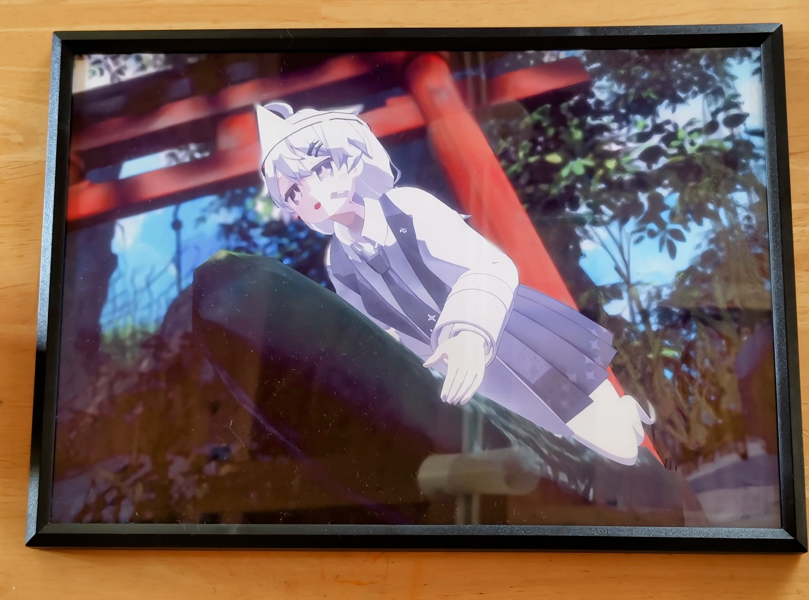

+++
date = '2025-08-18T19:56:41+09:00'
draft = false
title = 'LAV作戦に出展した話'
slug = 'Operation Lav'
tags = ["VRpic","雑記"]
categories = ["VRpic","雑記"]
comments = true
+++
## 初めに
こんにちは、pi-tyakuです。この前、VPS2025のLAV作戦に応募していた写真が届いていました。 

やはり、VRで撮った写真が現実世界の物品として届くと嬉しい気持ちでいっぱいになりますね。 
というわけで今回はLAV作戦に応募した経緯と作品の感想を簡単に書きたいと思います。
## LAV作戦とは？
Amanekoさん主催のVirtualPhotography Showcase 通称VPSにて行っていた参加型の企画です。以下は公式サイトからの引用です。

> 本作戦は全てのVRChatユーザーを対象にバーチャルフォトを集めて金沢21世紀美術館に展示し、来場者のみなさまにバーチャルフォトの存在と、その向こう側にある文化を見せることを目的に立ち上げました。

​この様に比較的誰でも参加できる企画となっています。

## 応募した経緯
応募した経緯としては、久しぶりにリアル会場での展示をしたかったのと、**展示後の写真が返送される**という大きめのメリットがあった為参加しました。 
やはり、「現実の物品が届く」というのは面白く映りますし、久しぶりにリアル会場での展示が出来るとなると参加するしかないと思いました。

## 返送品の状態など
今回のVPSは現地には行けなかったものの、無事に飾られていた写真が返送されました。
 やはり美術館に展示されていたため、写真の質感が素晴らしいです。
|VR|Real|
|:--:|:--:|
|||

やはり印刷されても見栄えは良いですね。
## 感想
1年ぶりにリアル会場での展示に応募したので、中々専用の写真の選定等の作業がかなり重かった。本当に... 
でも、実際に印刷された写真や来た人からの[反応](https://x.com/k_hakura/status/1948614261225521289)等が有ると、嬉しい気持ちになります。
また来年も出したいですし、現地に向かって色々な作品をみたいと感じました！