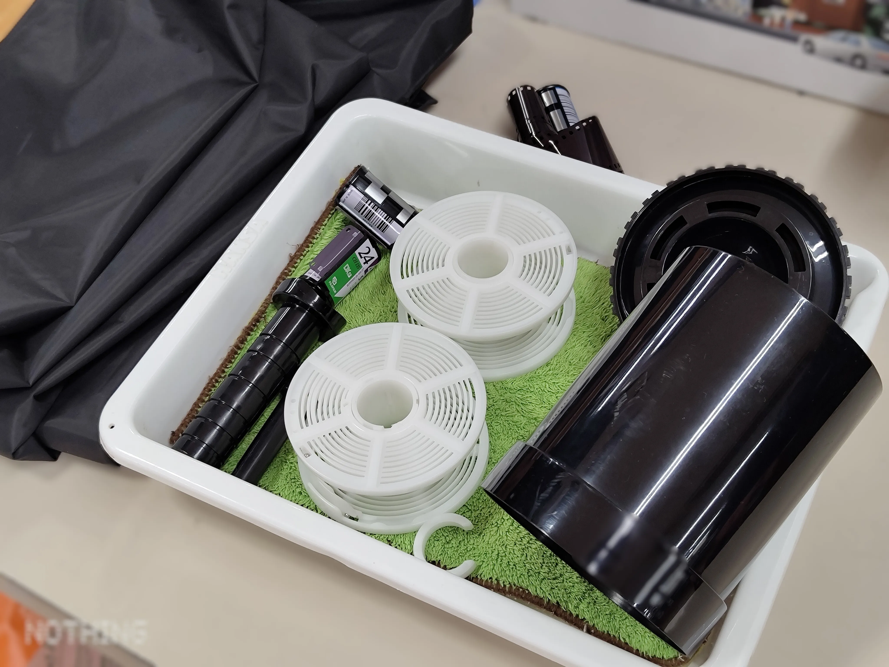
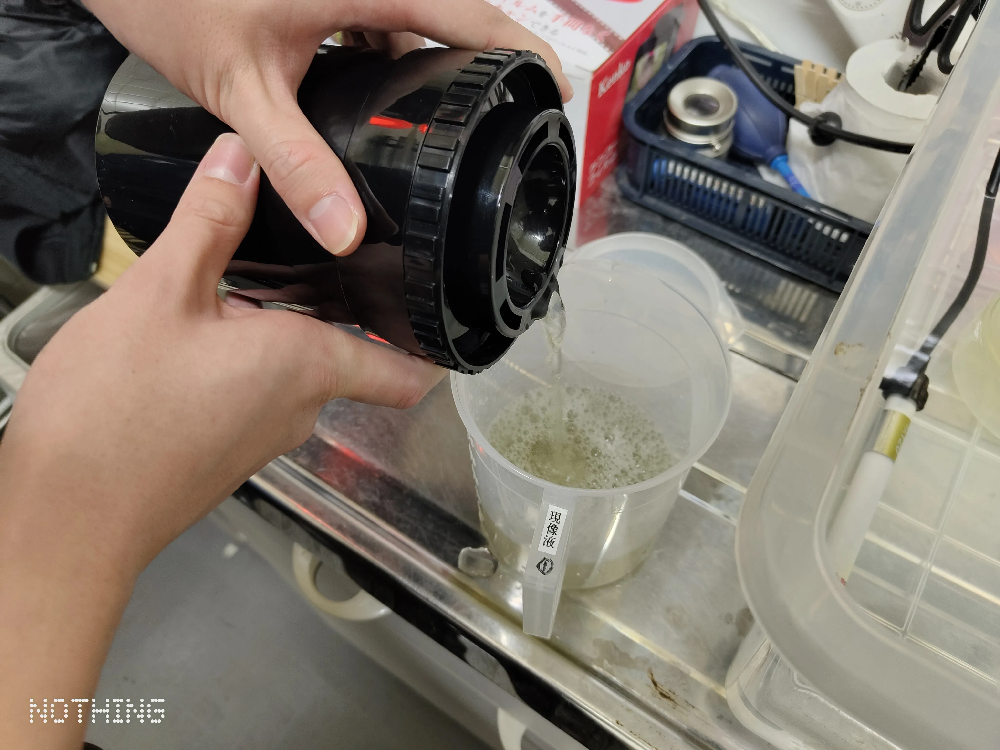
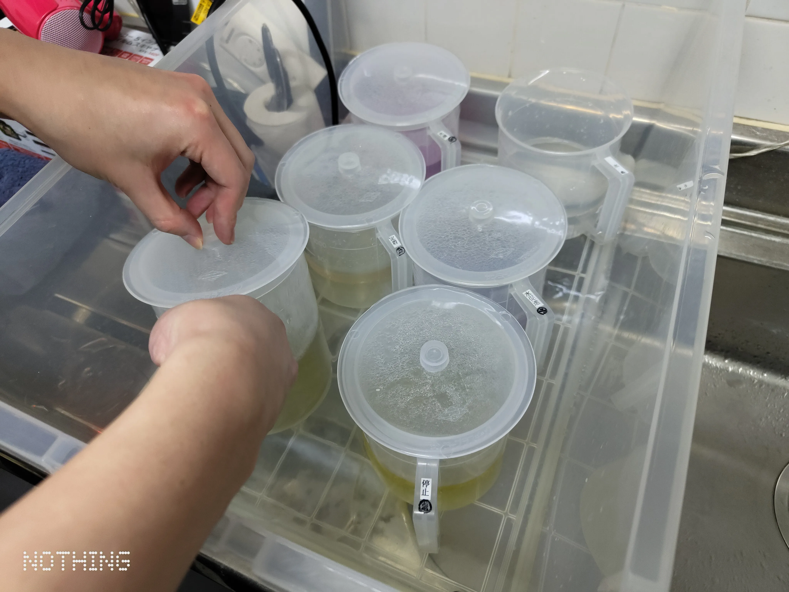
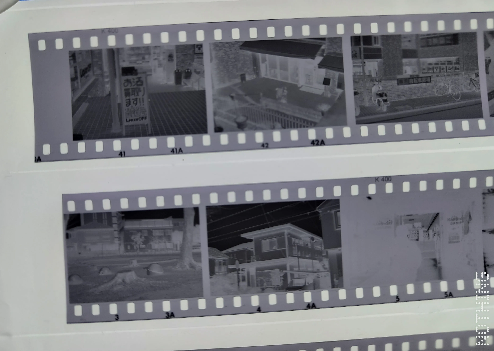
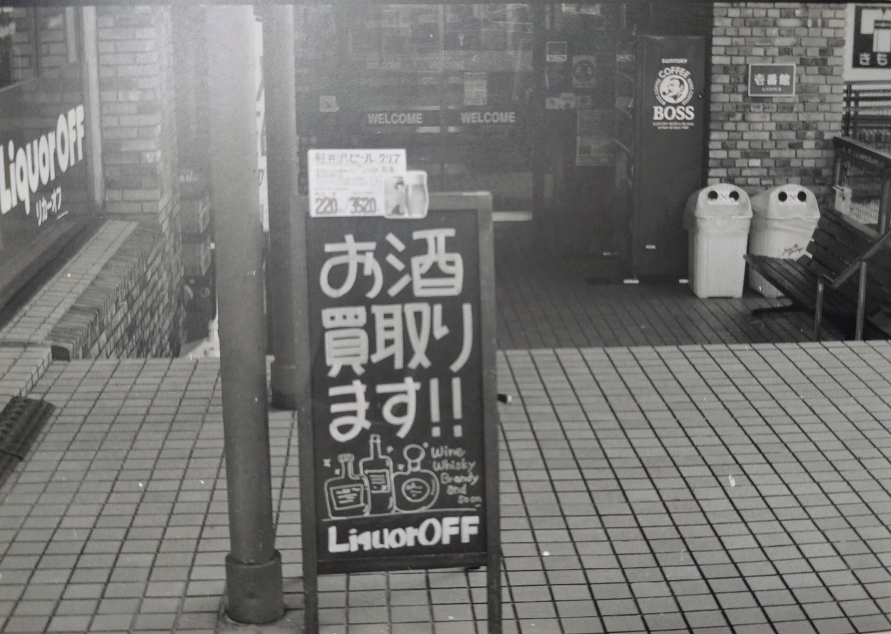

+++
date = '2025-12-29T18:28:55+09:00'
draft = false
title = 'フィルムの現像体験をした話'
slug = 'Developed_film'
tags = ["雑記","photo"]
categories = ["雑記","photo"]
comments = true
+++
## はじめに
こんにちは、pi-tyakuです。寒さが厳しく、真冬の足音がどんどん近づいているのを感じる季節になってきました。  
そんな中、35mmモノクロフィルムの現像体験を行ってきたので簡単なレポートを残します。
## 場所
今回、モノクロフィルムの現像体験を行った場所は、八王子大和田のハードオフです。
twitterでちょくちょくバズっている**全てのハードオフ**が揃った店です。  
たまたまやっていることを見かけたので、フィルムカメラをやっている友人を誘って行きました。

## 流れ
現像の流れとしては、
1. フィルム撮影
2. フィルム引き出し
3. フィルム現像
4. ネガフィルムの印刷
の順番で作りました。

### 撮影とフィルムの引き出し
今回使用したカメラはNikomart FTnです。  
ハードオフ近辺をうろつきながら撮影をしていました。
今回の撮影では、**何故かカメラの露光計の電池が無くなっていた**ので、露光計無しの感覚撮影になっていました。どうして。  
撮影が終わったら、35mmフィルムの引き出しをします。  
  
35mmフィルムは「光にあてた瞬間」に撮影した写真が一気に駄目になります。
なので、遮光された環境でフィルムを引き出して、現像を行うタンクに入れなければいけません。
遮光された環境、すなわち「完全に見えない環境」で「フィルムを引き出す」という人生で一度もやったことがない事をしなければいけないのです。  
  
フィルムの引き出しは次のような手順で行いました。
1. 暗室にフィルムとフィルムを巻きつけるやつ、巻き付けたフィルムを入れるタンク、ハサミ等を入れる
2. フィルムを限界まで引き伸ばす
3. 引き延ばしたファイルをフィルムを巻きつける奴にセットする
4. フィルムを巻きつける
5. 巻き付け終わったら、フィルムをカットする
6. 巻き付けたフィルムをタンクに入れる
7. タンクを閉める

という風に作業しました。
「ココで失敗したらフィルムが台無しになる...」という結構な重圧に晒されつつも何とか作業を終えました。

### 現像
というわけで何とかフィルムの引き出しを行い、フィルムを入れておいたタンクを使って現像を行いました。  
  
手順は次のようになっています。
1. タンクに現像液を入れて攪拌、放置を繰り返す
2. 現像液を出して、停止液を入れて攪拌する
3. 停止液を出して、定着液を入れて攪拌、放置をする
4. 定着液を出して、水洗促進剤が入った水を入れて攪拌する
5. 水を出して、フィルムを取り出し、乾燥させる
6. 乾燥後、いい感じにカットする
7. 完成！

というわけです。かなり理科の実験ですねコレ。  
  
中学・高校時代の理科及び化学の実験よりも実験してる手順でとても面白かったです。攪拌とかもあってただ黙って待ってれば良い訳ではないので。  
フィルムの乾燥になった際、明らかに写真の明るさのムラがあって面白かったです。実質的にガチャですもの。  

### 印刷
やっとココまで進んだことによってフィルムのネガが出来ました。ココからは写真を紙に印刷します。  
勿論フィルムのネガをPCに取り込んで、ネガ反転してインクジェットプリンターやレーザープリンターで印刷すれば簡単ですが、今回は違う方法で印刷します。
というわけで、印画紙を使ってネガフィルムから直接印刷をしました。
ココからは部屋内の電灯を落とし、作業用の赤い電灯のみを利用した赤く、薄暗い環境で作業します。
この作業では、次の手順になっています。
1. ネガフィルムを引き延ばし機にセット
2. 引き延ばし機のチェックモードでセット出来ているか確認する
3. 引き延ばし機に印画紙をセット
4. 引き延ばし機の照射モードで光を照射
5. 印画紙を現像液に浸す
6. 印画紙を停止液に浸す
7. 印画紙を定着液に浸す
8. 印画紙を水で洗う
9. 完成！

という風になってます。コレを激烈に見えづらい中でやります。  
5から8までは現像と同じ手順ですが、こっちは時間が短いです。大体現像の場合は1から2min程度で作業のプロセスが変わりますが、印刷だと20~40secで作業のプロセスが変わります。コレがまぁキツイ。  
ただでさえ悪い視界の中、見えづらい時計とにらめっこしながら紙をトングで掴まなきゃいけないので。  
撮影->フィルムの引き出し->現像->印刷なのでかなり疲れている中で作業をしていました。ぶっちゃけ「早く終わんねぇかな」って思うくらいには疲れていましたね。~~この記事を書く時も同じくらい疲れますけど。~~  
まぁともかく、とりあえず文句は無い位のレベルで印刷出来たので良かったです。  
次からはレーザープリンターを使いますが。
## 完成物
というわけで撮影した写真と、印刷した写真がコレです。

## 感想
とりあえず完走した感想ですが、「**楽しいけど長い!**」これに尽きます。
結局コレをやるのに3h程度掛かっているんですよね。「良くも悪くもクソ暇な時にやれる良い趣味」になると思いますね。
まぁともかく面白かったので良かったです。  
因みに記事を書くのに異常に時間が掛かりました。手順が多いし、文字数も多いのでわかりきっていたのですが。
