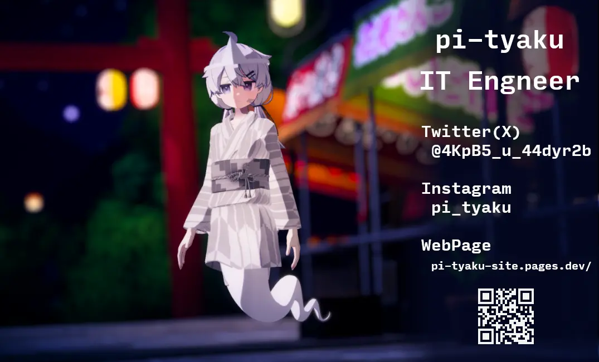
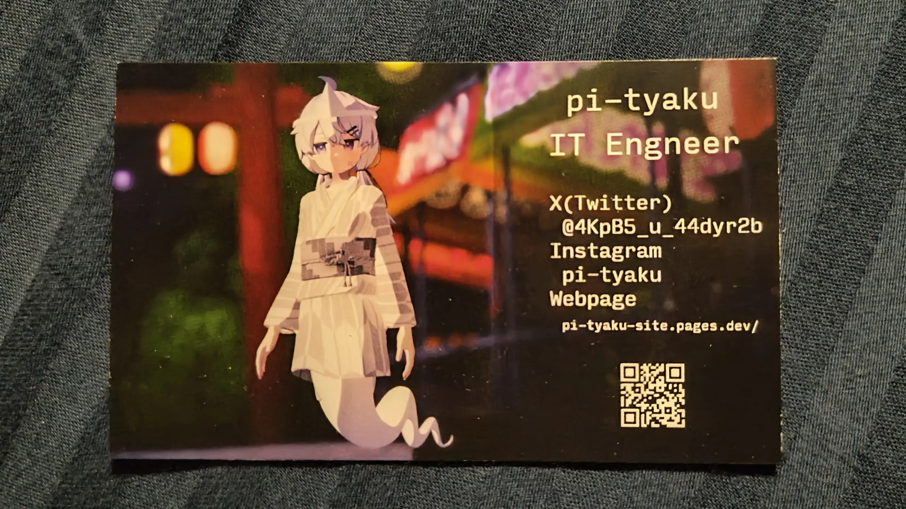
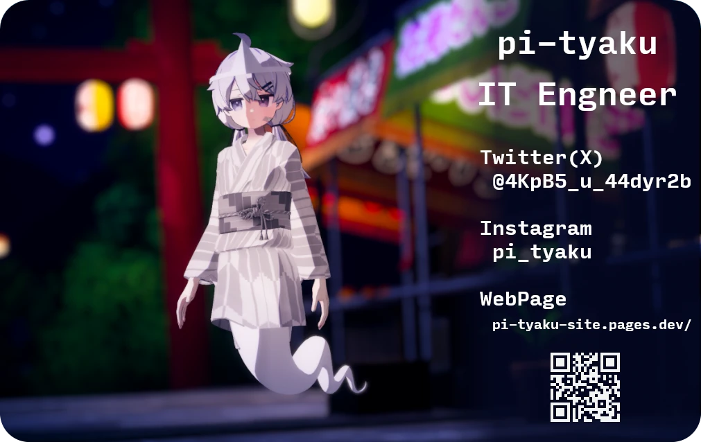
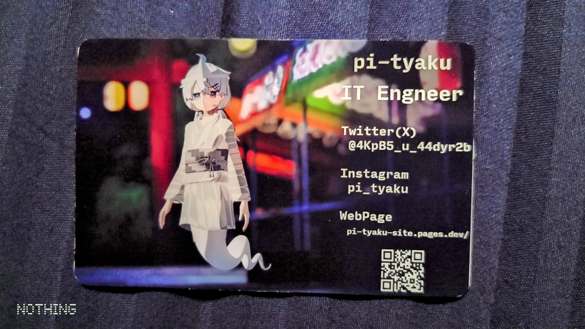

+++
date = '2025-08-25T15:53:21+09:00'
draft = false
title = '名刺とかを作った話'
slug = 'Made_new_namecard'
tags = ["雑記","Tech"]
categories = ["雑記","Tech"]
comments = true
+++
## 初めに
こんにちは、pi-tyakuです。 
[この前](/content/post/Want_to_remake_name_card)言っていた名刺が完成したので報告兼レポートをつらつらと書いていこうと思います。
## 写真の選定とデザイン
今回もGIMPを利用して製作しました。PhotoShopなんかのAdobe製品はかなりコストがかかるので相変わらずフリーウェアです。 
今回は、デザインより背景に採用する写真の選定に結構手間取りました。理由としては、直近で**横構図**＋**幽霊尻尾**が入る写真が殆ど無かったからです。最近は幽霊っぽい写真の殆どは**縦**の構図になっています。横構図だと、体全体を写そうとすると被写体が小さくなります。なので投稿する写真としては少なくなるんですよね。だからといって名刺を縦にするのも良くないですし。 
だけども、たまたま**横構図**＋**全身が写っている**＋**雰囲気◎**＋**空白大きめ**のいい写真があったので、それを採用しました。 

前回の名刺と同じように右側に文字を乗せて、QRコードを乗せて完成しました。とりあえず、遠目から見たときに違和感を感じないように作りました。 
正直に言うと、デザインのことは**全く分からない**ので、わりと適当に作りました。

## 制作を依頼した会社
今回も[Accea Express様](https://ex.accea.co.jp/)を利用して作りました。 
390円で両面カラー名刺が作れて、凄い速さで作ってくれるヤバいお店です。そこの設定として、55x91(mm)のpdfファイルで入稿する事が出来るので、作ったファイルを入稿しました。 
そしたら、3mmの塗足しが必要だったため、**61x97(mm)**で再設定して作り直す羽目になりました。よくよく書いてあったのに何故見落としていたのか...次に、作るときは気を付けようと思います。

## 仕上がり
というわけで、データを再入稿した2日後、実物が届きました。

相変わらず早く、出来上がりも素晴らしい。これだから人に薦めたいサービスなんですよね。
## ICカード版の製作
紙の名刺は制作出来たので、次に、ブランクICカード版の名刺を作っていこうと思います。 
[カードマーケット様](https://cardmarket.jp/article/glossary/09/)より 

>85.598mm(長辺)×53.975mm(短辺)、3.18mm(角R)、0.762mm(厚み)がJIS規格で定められた正確なプラスチックカードのサイズになります。
>一般的には85.6mm×54mm、角3R、厚み0.76mmで表記されます。

となっています。なので85.5x54(mm)で角の丸さを3mmに設定してGIMPでファイルを作りました。

出来上がったファイルをローソンで印刷できるＬ版サイズ内に設置します。そうすることによって質の良いシール印刷が可能になります。

## 結果
印刷して切り抜き、カードに貼った結果がこちらです。

切り抜き難易度が異常に高い配置にした自分が恨めしかったです。もっと切るとき用のバッファを確保してやるべきだったと思います。少なくとも5mmぐらいは取っておくとカッターでもハサミでも切りやすくなると思います。