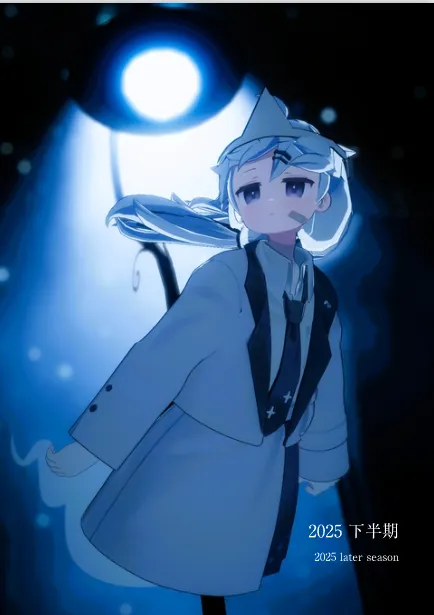

+++
date = '2025-12-22T15:22:26+09:00'
draft = false
title = '2025年後期のフォトブックを作った話'
slug = 'Made_photobook'
tags = ["Photo"]
categories = ["Photo"]
comments = true
+++

## はじめに
皆さんどうもこんにちは、pi-tyakuです。真冬ですね、天気が。いやもう本当に。  
そんな中、2025年の後期のフォトブックを完成させたので軽く書いていきます。

## 仕様
### 表紙

### ページ数
**全面フルカラー72p**

### 写真数
**191枚**
### 使用印刷所
**しまうまプリント**
### 総評
**無駄に豪華!**

## 感想
-  今回も作るのに時間がかかりました。(2week程度かかった)  
- 前回は48pだったのに写真が多くなったので72pになりました。だから構成を考えたりするのに時間が掛かる掛かる。  
- 毎回言いたくなりますが、本という物は16:9の割合を扱うのに都合が悪い。もう嫌になりそう。  
- 今回は写真以外にも「キャプション」や「まえがき」、「あとがき」を入れました。このサイトで色々書いたノウハウが活きた部分だと思います。  
- 前回のフォトブックを「買いたい!」っていう人が居ました。多分、今回のも買う可能性が有るかもしれない...~~良いのかコレで...~~
    - 因みに一般向けに頒布及び販売する予定はありません。規約が面倒なので。
    - 「買いたい!」って言っている人は印刷代と送料を払い、しまうまプリント公式の機能で購入しています。私自身に利益等は発生していません。
- 普通のVRChatter及び一般の人はこんなページ数(72p or 48p)で作らない方がいいです。手間がかかりすぎるので。